# Documentation fonctionnelle

## Plateforme d’agrégation et d’orchestration des paiements

Vue d’ensemble du produit, responsabilités métier et modélisation par cœur métier

| Nature | Référentiel d’analyse fonctionnelle |
| --- | --- |
| Version | 0.3 - Référentiel consolidé de travail |
| Statut | Base de discussion et de consolidation |
| Périmètre initial | Clients particuliers, partenaires de paiement, collecte et versement |

| Positionnement du document / Ce document n’est pas un cahier des charges ni une spécification technique. Il décrit le produit du point de vue métier : ses domaines de responsabilité, les notions qu’ils manipulent, leurs interactions et une trajectoire de réalisation progressive. |
| --- |

20 novembre 2026

## Comment lire et utiliser cette documentation

Cette documentation rassemble les responsabilités fonctionnelles de la future plateforme dans une même vue. Elle sert de référentiel commun pour discuter du produit cœur métier par cœur métier, sans décider prématurément de son implémentation.

| Ce document décrit | Ce document ne cherche pas encore à figer |
| --- | --- |
| Les acteurs, les capacités métier et les processus principaux. | Les écrans détaillés, les règles exhaustives de validation ou les contrats API finaux. |
| Les concepts métier et les relations entre eux. | Le schéma physique des bases de données ou les technologies. |
| Les frontières de responsabilité et les dépendances entre domaines. | Le nombre définitif de microservices, de bases ou de déploiements. |
| Une proposition de périmètre progressif. | Un engagement de livraison, un SLA contractuel ou une conformité réglementaire déjà acquise. |

### Sommaire

- 1. Vision et positionnement du produit

- 2. Principes fonctionnels structurants

- 3. Acteurs et vocabulaire commun

- 4. Carte globale des cœurs métier

- 5. Étude des cœurs métier

- 6. Modèle conceptuel transversal

- 7. Parcours métier de bout en bout

- 8. Progression fonctionnelle par étapes

- 9. Décisions à consolider

- 10. Glossaire

| Convention de lecture / Les noms en majuscules (CUSTOMER, FINANCIAL_OPERATION, LEDGER_ENTRY, etc.) sont des noms conceptuels proposés pour faciliter les échanges. Ils ne constituent pas encore un schéma de données définitif. |
| --- |

## 1. Vision et positionnement du produit

### 1.1. Vision

Construire une plateforme qui centralise les relations avec plusieurs partenaires financiers et rend leurs moyens de paiement accessibles à travers un modèle fonctionnel cohérent. La plateforme doit permettre d’enregistrer les partenaires, de décrire les moyens de paiement qu’ils proposent, d’orchestrer les opérations et d’en assurer le suivi opérationnel et financier.

Le premier modèle de clientèle envisagé est constitué de particuliers inscrits et accompagnés par l’entreprise. Après leur enregistrement et leur activation auprès des partenaires nécessaires, ces clients peuvent bénéficier de capacités de collecte et demander le versement de fonds sur un compte bancaire éligible.

### 1.2. Proposition de valeur

- Uniformiser l’accès à des partenaires dont les API, les méthodes de paiement et les règles diffèrent.

- Réduire le coût d’intégration d’un nouveau partenaire ou d’une nouvelle méthode de paiement.

- Assurer une traçabilité de bout en bout des opérations, depuis la demande jusqu’à la confirmation financière.

- Encadrer l’activation des clients et les opérations sensibles par des processus internes.

- Connaître les montants collectés, les frais, les montants dus aux clients et les versements réalisés.

- Permettre une évolution progressive vers davantage de partenaires, de pays, de devises et, éventuellement, une API B2B.

### 1.3. Périmètre de départ

| Dans le périmètre fonctionnel visé | Hors périmètre initial / à confirmer |
| --- | --- |
| Gestion de partenaires et de leurs méthodes de paiement. | Marketplace ouverte permettant à tout commerçant de s’inscrire sans accompagnement. |
| Gestion des clients particuliers, de leur dossier et de leur activation. | Gestion de plusieurs utilisateurs rattachés à une même entreprise cliente. |
| Collecte, suivi des opérations, demandes de remboursement ou d’annulation selon capacités partenaires. | Crédit, épargne, prêt ou autres produits bancaires. |
| Demande de versement du client vers un compte bancaire et circuit de validation. | Réseau bancaire propriétaire ou tenue de comptes bancaires. |
| Suivi comptable interne des sommes et des frais. | Émission autonome de monnaie électronique ou conservation réglementée de fonds sans cadre validé. |
| Intégration successive de Mobile Money et de cartes bancaires. | Routage intelligent complexe et bascule automatique multi-prestataires dès la première version. |

### 1.4. Canaux d’accès au produit

| Canal | Responsabilité fonctionnelle |
| --- | --- |
| Espace client | Inscription, consultation des opérations, initiation des collectes selon le parcours retenu, ajout de coordonnées bancaires et demande de versement. |
| Back-office interne | Gestion des clients, activation, traitement des dossiers, approbations, suivi des opérations et rapprochement. |
| Connecteurs partenaires | Échanges sortants avec les prestataires et réception des callbacks ou notifications de statut. |
| API tierce publique | Éventuelle ouverture à des entreprises ou plateformes externes. Cette exposition B2B est une piste future et ne constitue pas une hypothèse de départ. |

Les canaux sont des points d’accès aux capacités métier. Ils ne constituent pas, à eux seuls, des cœurs métier supplémentaires : un même parcours peut être initié depuis un espace client, traité dans le back-office et exécuté via un partenaire.

| Point de vigilance sur le rôle financier / Le produit doit distinguer le suivi comptable d’un montant dû au client de la détention juridique et matérielle des fonds. La plateforme peut suivre un solde sans être elle-même le dépositaire des fonds. Le modèle de conservation, de cantonnement et de règlement doit être validé séparément avant de figer les parcours financiers. |
| --- |

## 2. Principes fonctionnels structurants

| Principe | Conséquence fonctionnelle |
| --- | --- |
| Le partenaire n’est pas le moyen de paiement. | Un partenaire peut proposer plusieurs méthodes. Une méthode peut exposer plusieurs capacités : collecte, remboursement, consultation de statut ou versement. |
| Une capacité métier n’est pas une URL. | COLLECTION ou REFUND sont des opérations métier. Leur chemin HTTP, leur payload et leur mode d’authentification ne sont que la manière dont un partenaire expose cette capacité. |
| Une opération n’est pas une tentative technique. | Une même opération métier peut donner lieu à plusieurs échanges ou vérifications techniques. Ces tentatives doivent rester historisées. |
| Un statut technique ne vaut pas confirmation financière. | Un timeout ou une rupture réseau peut laisser une opération dans un état inconnu. La plateforme doit vérifier son résultat avant toute nouvelle exécution risquée. |
| Annulation, remboursement et extourne sont distincts. | L’annulation vise à empêcher une opération non finalisée. Le remboursement restitue des fonds déjà collectés. L’extourne corrige une écriture comptable. |
| Les mouvements financiers doivent être traçables. | Chaque changement important doit avoir une référence, une origine, un horodatage, un auteur ou un système initiateur et une justification lorsque nécessaire. |
| Les règles doivent être configurables, mais gouvernées. | Les frais, limites, mappings et paramètres partenaires peuvent être configurables, avec validation, versionnement et historique. |
| La séparation des responsabilités est une règle métier. | Une personne qui prépare une opération sensible ne doit pas nécessairement pouvoir l’approuver seule. Les seuils et exceptions restent à définir. |
| Le produit doit fonctionner même si un partenaire est indisponible. | Les opérations doivent avoir des états d’attente, de vérification et de reprise contrôlée. Une indisponibilité ne doit pas produire une fausse confirmation ou une double collecte. |

## 3. Acteurs et vocabulaire commun

| Acteur / notion | Définition et rôle |
| --- | --- |
| CUSTOMER | Particulier titulaire de la relation avec la plateforme. Il dispose d’une identité de connexion et d’un dossier client. Un seul utilisateur principal par client est envisagé au départ. |
| PAYER | Personne qui fournit les fonds lors d’une collecte. Elle peut être différente du CUSTOMER et ne doit pas être automatiquement assimilée au titulaire du compte plateforme. |
| OPERATIONS_AGENT | Collaborateur interne chargé de traiter un dossier, vérifier des informations, suivre une activation ou instruire une demande. |
| OPERATIONS_SUPERVISOR | Collaborateur habilité à approuver, rejeter ou arbitrer certaines opérations, selon des règles de délégation. |
| CONFIGURATION_ADMIN | Collaborateur autorisé à gérer le catalogue des partenaires, les méthodes, les paramètres d’intégration et leur mise en production. |
| FINANCE / RECONCILIATION | Fonction interne qui contrôle les mouvements, les frais, les écarts, les règlements et les soldes. |
| PARTNER | Prestataire ou agrégateur externe donnant accès à un ou plusieurs moyens de paiement. |
| PAYMENT_METHOD | Moyen ou produit de paiement exposé par un partenaire : OM, MoMo, OM Merchant, carte, etc. |
| BANK / BENEFICIARY ACCOUNT | Établissement bancaire et coordonnées du compte destinataire d’un versement. Les règles de format et de routage dépendent du pays et de la banque. |

| Distinction à ne pas perdre / Le CUSTOMER est le client de notre plateforme. Le PAYER est l’émetteur des fonds d’une collecte. Le bénéficiaire d’une collecte peut être le CUSTOMER, mais cette relation doit être explicitement portée par l’opération. Cette distinction évite de mélanger identité, initiateur du paiement et bénéficiaire économique. |
| --- |

## 4. Carte globale des cœurs métier

La plateforme est structurée autour de quatorze cœurs métier complémentaires, chacun portant une responsabilité fonctionnelle identifiable. Les domaines sont liés, mais chacun possède une responsabilité principale et des règles propres.

| Cœur métier | Question à laquelle il répond | Résultat attendu |
| --- | --- | --- |
| 1. Identité et accès | Qui utilise la plateforme et que peut-il faire ? | Accès sécurisé, rôles et permissions. |
| 2. Cycle de vie client | Qui est le client et où en est son activation ? | Dossier client fiable et statut opérationnel. |
| 3. Référentiel partenaires et méthodes | Quels prestataires et moyens sont disponibles ? | Catalogue des options de paiement activables. |
| 4. Configuration des intégrations | Comment chaque capacité métier est-elle traduite vers un partenaire ? | Contrats d’endpoint, mappings et paramètres maîtrisés. |
| 5. Orchestration des paiements | Quelle opération doit être exécutée et quel est son résultat ? | Opération métier suivie de bout en bout. |
| 6. Comptes et comptabilité interne | Quels montants sont dus, réservés, reçus ou payés ? | Soldes explicables et écritures équilibrées. |
| 7. Versements | Comment un montant est-il payé au client ? | Demande contrôlée, approuvée et exécutée. |
| 8. Tarification | Quels frais s’appliquent et à qui ? | Calcul explicite des frais et commissions. |
| 9. Risque et conformité | L’opération et le client sont-ils éligibles ? | Contrôles, limites et alertes. |
| 10. Opérations internes | Qui traite les dossiers et exceptions ? | File de travail, validation et résolution. |
| 11. Rapprochement financier | Nos données concordent-elles avec celles des partenaires ? | Écarts identifiés et résolus. |
| 12. Notifications et reporting | Qui doit être informé et que faut-il piloter ? | Information des acteurs et indicateurs fiables. |
| 13. Audit et traçabilité | Qui a fait quoi, quand, sur quel objet et pourquoi ? | Historique fiable des actions, décisions et changements sensibles. |
| 14. Litiges et contestations | Comment instruire une contestation liée à une opération ? | Décision documentée, traitement de la contestation et issue financière tracée. |

## 5. Étude des cœurs métier

Les sections suivantes décrivent les quatorze cœurs métier à un niveau fonctionnel approfondi. Elles précisent sa mission, ses responsabilités, les objets qu’il porte, ses frontières et ses interactions. Les règles détaillées seront consolidées lors des ateliers consacrés à chaque domaine.

### 5.1. Identité et contrôle des accès

**Mission:** Gérer les identités qui accèdent à la plateforme et appliquer les droits associés à chaque profil.

**Responsabilités:**

- Enregistrer et authentifier les clients particuliers et les collaborateurs internes.

- Gérer les identifiants, les moyens de récupération, les sessions et les mécanismes de sécurité.

- Associer une identité à un CUSTOMER ou à un collaborateur interne.

- Définir des rôles et permissions distincts : client, agent, superviseur, administrateur de configuration, finance.

- Appliquer des contrôles renforcés aux actions sensibles : approbation d’un versement, modification de coordonnées bancaires, publication d’une configuration partenaire.

- Tracer les connexions et les changements sensibles.

**Éléments métier principalement portés :** USER_IDENTITY, ROLE, PERMISSION, USER_SESSION, ACCESS_EVENT.

**Frontières : (ce que ce cœur ne fait pas.)** Ce cœur ne porte pas le dossier KYC complet, le solde financier ni les règles d’exécution des paiements. Il décide de l’identité et des droits, pas de l’éligibilité financière d’une opération.

**Interactions principales :** Customer Management pour le lien identité-client ; Operations Management pour les agents et approbateurs ; Audit pour la traçabilité.

**Progression indicative :** Indispensable dès la première version. La granularité des rôles peut rester simple au départ, tout en prévoyant la séparation agent/superviseur.

### 5.2. Gestion du cycle de vie client

**Mission :** Gérer la relation avec un particulier depuis son inscription jusqu’à son activation, sa suspension ou sa clôture.

**Responsabilités :**

- Collecter les informations d’identité, les coordonnées et les pièces justificatives nécessaires.

- Créer un dossier client unique et éviter les doublons d’identité.

- Gérer les états du dossier : brouillon, soumis, à vérifier, incomplet, validé, rejeté, suspendu, clôturé.

- Créer et suivre une demande d’activation auprès des partenaires concernés.

- Affecter le dossier à un agent et enregistrer les démarches, retours, références externes et dates.

- Conserver les informations propres au client : méthodes autorisées, limites particulières, paramètres et données de rattachement fournies par les partenaires.

- Gérer les changements de coordonnées et les réexamens périodiques lorsque requis.

**Éléments métier principalement portés :** CUSTOMER, CUSTOMER_PROFILE, CUSTOMER_DOCUMENT, CUSTOMER_ACTIVATION_REQUEST, CUSTOMER_PROVIDER_LINK, CUSTOMER_CONFIGURATION.

**Frontières (ce que ce cœur ne fait pas) :** Ce cœur ne crée pas arbitrairement les comptes chez les partenaires : il pilote le dossier et enregistre le résultat des démarches. Il ne réalise pas non plus les transactions.

**Interactions principales :** Identity & Access pour les identifiants ; Partner Registry pour les prestataires concernés ; Operations pour le traitement manuel ; Risk & Compliance pour les contrôles requis.

**Progression indicative :** Prioritaire. L’activation peut être manuelle au départ, avec un délai opérationnel cible indicatif de 1 à 2 jours après soumission complète. Ce délai doit être confirmé avec les partenaires et ne constitue pas automatiquement un engagement contractuel.

### 5.3. Référentiel des partenaires et des moyens de paiement

**Mission :** Décrire les prestataires connectés à la plateforme et les méthodes qu’ils mettent à disposition.

**Responsabilités :**

- Créer et maintenir la fiche d’un PARTNER : identité, type, pays, statut, contacts opérationnels et cadre contractuel.

- Enregistrer les PAYMENT_METHODS proposés par chaque partenaire : Orange Money, MTN MoMo, Orange Merchant, cartes, etc.

- Associer chaque méthode aux pays, devises, profils clients et canaux qu’elle supporte.

- Décrire les capacités métier supportées par chaque méthode : collecte, remboursement, consultation de statut, annulation, versement ou transfert.

- Activer, désactiver ou suspendre une méthode sans supprimer l’historique des opérations.

- Indiquer les environnements disponibles et les restrictions connues.

**Éléments métier principalement portés :** PARTNER, PAYMENT_METHOD, METHOD_CAPABILITY, COUNTRY, CURRENCY, PARTNER_CONTRACT_REFERENCE.

**Frontières (ce que ce cœur ne fait pas) :** Ce cœur ne contient pas les détails de mapping HTTP ou les secrets techniques. Il indique ce qui existe et ce qui est fonctionnellement proposé ; la configuration d’appel relève du cœur d’intégration.

**Interactions principales :** Partner Integration Configuration pour les contrats techniques ; Payment Orchestration pour sélectionner une méthode disponible ; Customer Management pour les méthodes autorisées à un client.

**Progression indicative :** Prioritaire. Commencer par le partenaire X et ses méthodes OM / MoMo disponibles contractuellement. Ajouter les cartes lorsque le second partenaire est effectivement acquis et qualifié.

### 5.4. Configuration des intégrations partenaires

**Mission :** Décrire de manière maîtrisée comment les capacités de la plateforme sont traduites en appels vers les API de chaque partenaire.

**Responsabilités :**

- Définir, pour une méthode donnée, les endpoints associés à chaque capacité métier.

- Enregistrer le chemin relatif, la méthode HTTP, les paramètres, les en-têtes, les règles d’authentification et les délais d’attente.

- Décrire les schémas de requête et de réponse, les champs obligatoires, optionnels, statiques, mappés ou générés.

- Mapper les champs internes vers les noms attendus par le partenaire et inversement.

- Définir la correspondance entre les statuts et codes d’erreur du partenaire et les états normalisés de la plateforme.

- Gérer les callbacks/webhooks et, lorsque nécessaire, la consultation périodique de statut.

- Versionner les configurations, tester en sandbox, faire valider leur publication et pouvoir revenir à une version précédente.

- Référencer les secrets sans les afficher en clair dans les fiches de configuration ni les dupliquer endpoint par endpoint.

**Éléments métier principalement portés :** ENDPOINT_DEFINITION, REQUEST_SCHEMA, RESPONSE_SCHEMA, FIELD_MAPPING, ERROR_MAPPING, AUTH_PROFILE, PARTNER_ENVIRONMENT, CONFIGURATION_VERSION.

**Frontières (ce que ce cœur ne fait pas) :** Ce cœur ne décide pas du sens métier de COLLECTION ou REFUND. Il ne comptabilise pas les opérations et ne doit pas devenir un moteur d’exécution de scripts arbitraires non contrôlés.

**Interactions principales :** Partner Registry pour les capacités disponibles ; Payment Orchestration pour l’exécution ; Operations pour les tests et la publication ; Security pour la protection des secrets.

**Progression indicative :** La structure conceptuelle peut être pensée dès maintenant. En V1, seuls les endpoints nécessaires au premier partenaire doivent être configurables. La génération automatique de documentation et de collections API peut venir ensuite.

### 5.5. Orchestration des opérations de paiement

**Mission :** Piloter les opérations financières demandées à la plateforme et coordonner leur exécution auprès d’un partenaire.

**Responsabilités :**

- Recevoir une intention métier : collecte, remboursement, annulation, transfert ou consultation d’état.

- Valider les paramètres de l’opération : client, montant, devise, moyen choisi, bénéficiaire, référence et règles d’éligibilité.

- Créer une opération unique avec une référence interne et une clé d’idempotence.

- Sélectionner un partenaire et une méthode autorisés selon la configuration et les règles de disponibilité.

- Créer une ou plusieurs tentatives techniques et conserver leurs requêtes, réponses, références externes et erreurs utiles.

- Gérer les réponses synchrones, les notifications asynchrones et les vérifications de statut.

- Normaliser le résultat sans confondre rejet, échec certain, attente et résultat inconnu.

- Permettre la consultation de l’historique et relier les remboursements ou annulations à l’opération d’origine.

**Éléments métier principalement portés :** FINANCIAL_OPERATION, PAYMENT_ATTEMPT, OPERATION_EVENT, PROVIDER_REFERENCE, IDEMPOTENCY_RECORD, REFUND_LINK, CANCELLATION_REQUEST.

**Frontières (ce que ce cœur ne fait pas) :** Ce cœur n’est pas le grand livre comptable et ne décide pas seul de la disponibilité réelle des fonds. Il ne doit pas marquer une opération comme réussie sur la seule base d’un timeout ou d’une réponse ambiguë.

**Interactions principales :** Partner Registry et Integration Configuration pour l’exécution ; Risk & Pricing pour les validations et frais ; Ledger pour les écritures ; Notifications pour les confirmations ; Reconciliation pour le contrôle a posteriori.

**Progression indicative :** Le suivi des opérations et des tentatives est fondamental dès le départ. Commencer avec un partenaire et un nombre limité de méthodes/capacités. Les stratégies multi-partenaire et de routage avancé sont ultérieures.

### 5.6. Comptes clients et comptabilité interne

**Mission :** Conserver une représentation financière fiable des montants reçus, dus, réservés, payés et prélevés.

**Responsabilités :**

- Distinguer le compte fonctionnel du client, les comptes comptables internes et les comptes bancaires réels.

- Tenir un sous-grand-livre par client lorsque la plateforme doit calculer les montants qui lui sont dus.

- Enregistrer les mouvements en partie double : chaque journal doit être équilibré entre débits et crédits.

- Suivre les montants en attente, disponibles, réservés, payables, remboursés et réglés.

- Conserver le détail du montant brut, des frais partenaire, des frais plateforme et du montant net attribuable au client.

- Produire un solde explicable à partir des écritures ; le solde affiché ne doit pas être la seule source de vérité.

- Corriger une erreur par une écriture compensatrice tracée plutôt que par la modification ou la suppression d’une écriture validée.

- Gérer les suspens et comptes de transit lorsque les fonds sont en attente de confirmation ou de règlement.

**Éléments métier principalement portés :** CUSTOMER_ACCOUNT, LEDGER_ACCOUNT, JOURNAL, LEDGER_ENTRY, BALANCE_SNAPSHOT, FUNDS_RESERVATION, FINANCIAL_PERIOD.

**Frontières (ce que ce cœur ne fait pas) :** Ce cœur ne détient pas physiquement l’argent et ne détermine pas, à lui seul, le statut réglementaire du dispositif. Le registre comptable interne ne remplace pas les relevés bancaires ou les états du partenaire.

**Interactions principales :** Payment Orchestration pour les opérations confirmées ; Pricing pour les frais ; Payout pour les réservations et débits ; Reconciliation pour les écarts ; Finance pour la supervision.

**Progression indicative :** Le socle comptable minimal doit être conçu avant les premières opérations réelles. Les règles détaillées de reconnaissance des fonds et de disponibilité dépendent du modèle de détention et de règlement qui reste à confirmer.

### 5.7. Gestion des versements et décaissements

**Mission :** Permettre à un client de demander le versement d’un montant vers un compte bancaire et encadrer son traitement jusqu’à la confirmation.

**Responsabilités :**

- Permettre au client de choisir ou d’enregistrer un compte bancaire bénéficiaire.

- Gérer un référentiel de banques par pays et les informations de routage disponibles.

- Créer une PAYOUT_REQUEST avec montant, devise, bénéficiaire, frais estimés et motif.

- Vérifier l’éligibilité du client, le solde disponible, les limites, le statut du compte bénéficiaire et les contrôles de risque.

- Soumettre la demande à une file de traitement interne.

- Appliquer une séparation entre instruction et approbation selon le montant et les règles de délégation.

- Réserver le montant approprié pendant le traitement afin d’éviter les demandes concurrentes dépassant le solde disponible.

- Transmettre l’ordre au partenaire habilité, suivre les tentatives et gérer les résultats différés.

- Libérer la réservation en cas d’échec confirmé ou comptabiliser le versement en cas de succès confirmé.

**Éléments métier principalement portés :** PAYOUT_REQUEST, BANK, CUSTOMER_BANK_ACCOUNT, BENEFICIARY, PAYOUT_APPROVAL, PAYOUT_ATTEMPT, PAYOUT_EVENT.

**Frontières (ce que ce cœur ne fait pas) :** Ce cœur ne gère pas le catalogue global des endpoints et ne doit pas considérer la simple approbation interne comme la preuve que le bénéficiaire a reçu les fonds.

**Interactions principales :** Customer Management pour le bénéficiaire ; Ledger pour la disponibilité et les écritures ; Operations pour l’instruction ; Payment Orchestration / Integration pour l’exécution ; Reconciliation pour la confirmation.

**Progression indicative :** La création et l’approbation des demandes peuvent être introduites avant l’automatisation complète du transfert. L’exécution automatique dépend de la capacité réelle du partenaire et du cadre de conservation des fonds.

### 5.8. Tarification, frais et commissions

**Mission :** Définir les règles de calcul des frais et rendre le coût de chaque mouvement explicable.

**Responsabilités :**

- Définir les frais facturés au client selon le type d’opération, la méthode, le partenaire, le montant, la devise et éventuellement le profil.

- Enregistrer les frais facturés par le partenaire et les commissions ou marges de la plateforme.

- Gérer les frais fixes, proportionnels, minimums, maximums et les règles d’arrondi.

- Distinguer frais estimés avant exécution et frais réellement constatés après retour ou rapprochement.

- Appliquer une version de tarif datée à une opération afin de conserver la règle utilisée au moment de son initiation.

- Gérer les exceptions et tarifs négociés pour certains clients lorsque cela est autorisé.

**Éléments métier principalement portés:** FEE_POLICY, FEE_RULE, PARTNER_FEE, CUSTOMER_FEE, PRICING_VERSION, FEE_CALCULATION.

**Frontières (ce que ce cœur ne fait pas) :** Ce cœur ne comptabilise pas les frais dans le grand livre : il calcule et explique les montants. Le Ledger matérialise les écritures associées.

**Interactions principales :** Partner Registry pour les coûts connus du prestataire ; Customer Configuration pour les exceptions ; Payment et Payout pour l’application ; Ledger et Reconciliation pour les montants réellement comptabilisés.

**Progression indicative :** Un modèle simple et transparent est suffisant au départ. Les règles complexes par segment, palier ou négociation peuvent être introduites lorsque le modèle commercial est stabilisé.

### 5.9. Risque, conformité et éligibilité

**Mission :** Appliquer les contrôles qui déterminent si un client ou une opération peut être accepté, limité, différé ou refusé.

**Responsabilités :**

- Définir les informations et justificatifs nécessaires à la connaissance du client.

- Appliquer des limites par client, opération, période, méthode et pays.

- Contrôler les statuts du client, les méthodes activées et les restrictions applicables.

- Détecter des situations nécessitant une vérification : répétitions inhabituelles, incohérences, bénéficiaire modifié récemment ou opération atypique.

- Déclencher une revue manuelle et conserver le motif de blocage, d’acceptation ou de rejet.

- Gérer les contrôles et listes requis par les obligations applicables, après validation juridique et conformité.

**Éléments métier principalement portés :** ELIGIBILITY_RULE, TRANSACTION_LIMIT, RISK_ALERT, COMPLIANCE_REVIEW, KYC_CHECK, RESTRICTION.

**Frontières (ce que ce cœur ne fait pas) :** Ce cœur ne remplace pas l’avis juridique ou conformité et ne doit pas inventer des obligations réglementaires. Les contrôles effectifs dépendront des contrats, du pays et du rôle exact de la plateforme.

**Interactions principales :** Customer Management pour les dossiers ; Payment et Payout pour les décisions d’éligibilité ; Operations pour les revues ; Audit pour les preuves de décision.

**Progression indicative :** Les contrôles de base sont nécessaires dès le pilote. Les moteurs de détection avancée et les règles automatisées évoluent avec les volumes et les risques observés.

### 5.10. Opérations internes et gestion des dossiers

**Mission :** Organiser le travail des équipes internes, les validations et la résolution des cas qui nécessitent une intervention humaine.

**Responsabilités :**

- Centraliser les tâches liées à l’activation des clients, aux demandes de versement, aux opérations en anomalie et aux contestations.

- Affecter chaque dossier à une personne ou une équipe, avec priorité, échéance et statut de traitement.

- Enregistrer les notes internes, pièces complémentaires, décisions et motifs.

- Mettre en place des circuits de validation avec séparation des rôles.

- Permettre l’escalade d’un dossier, la réaffectation et le suivi des délais.

- Conserver le journal des actions manuelles sans écraser l’historique des décisions.

**Éléments métier principalement portés :** WORK_ITEM, CASE, CASE_ASSIGNMENT, APPROVAL, REVIEW_COMMENT, DECISION_RECORD, SLA_TARGET.

**Frontières :** Ce cœur ne possède pas les données financières de référence et ne réalise pas directement les appels de paiement. Il orchestre le travail humain autour des autres domaines.

**Interactions principales :** Customer, Payout, Risk, Reconciliation et Support pour les dossiers ; Identity & Access pour les droits ; Audit pour les traces.

**Progression indicative :** Indispensable dès la première version, même sous une forme simple : listes de dossiers, affectation, décision, commentaire et horodatage.

### 5.11. Rapprochement et règlement financier

**Mission :** Vérifier que les opérations internes correspondent aux informations et mouvements communiqués par les partenaires et les établissements financiers.

**Responsabilités :**

- Importer ou recevoir les rapports de transactions, règlements, commissions et remboursements des partenaires.

- Comparer les références, montants, devises, dates et statuts avec les opérations internes.

- Identifier les opérations manquantes, dupliquées, retardées ou présentant un montant différent.

- Suivre les fonds en transit et les montants effectivement réglés sur les comptes convenus.

- Créer des dossiers d’écart, affecter leur résolution et conserver les preuves.

- Valider les commissions et frais réellement prélevés par les partenaires.

- Produire une situation de rapprochement par partenaire, période et devise.

**Éléments métier principalement portés :** RECONCILIATION_BATCH, PROVIDER_STATEMENT, SETTLEMENT, MATCH_RESULT, RECONCILIATION_CASE, SETTLEMENT_REFERENCE.

**Frontières :** Ce cœur ne réexécute pas automatiquement une opération pour corriger un écart. Il constate, qualifie et suit l’écart ; toute correction passe par une opération ou une écriture autorisée.

**Interactions principales :** Payment Operations et Ledger pour les données internes ; Partner Integration pour récupérer les relevés ; Finance et Operations pour résoudre les écarts.

**Progression indicative. **Un rapprochement manuel assisté peut suffire au pilote, mais la capacité de rapprochement ne doit pas être oubliée dans la conception initiale.

### 5.12. Notifications, webhooks et reporting

**Mission :** Informer les acteurs concernés et fournir une visibilité opérationnelle sur l’activité de la plateforme.

**Responsabilités :**

- Informer le client des événements importants : inscription, activation, collecte, remboursement, demande de versement et résultat.

- Notifier les agents des nouveaux dossiers, opérations à examiner et anomalies.

- Gérer les préférences et canaux autorisés : email, SMS, notification applicative ou autre canal retenu.

- Conserver l’état d’envoi, les échecs et les tentatives de notification.

- Prévoir des webhooks sortants si une API destinée à des systèmes tiers est ouverte ultérieurement.

- Produire des indicateurs cohérents : volumes, taux de succès, montants, frais, versements en attente et écarts de rapprochement.

**Éléments métier principalement portés :** NOTIFICATION, NOTIFICATION_TEMPLATE, DELIVERY_ATTEMPT, WEBHOOK_SUBSCRIPTION, REPORT_DEFINITION, KPI_SNAPSHOT.

**Frontières :** Ce cœur ne détermine pas l’état métier d’une transaction. Il communique un événement déjà établi par le domaine responsable.

**Interactions principales :** Tous les domaines producteurs d’événements ; Identity & Access pour les préférences et autorisations ; Finance et Operations pour les tableaux de bord.

**Progression indicative :** Les notifications client et agent sont utiles dès le lancement. Les webhooks publics et les rapports analytiques avancés peuvent attendre une exposition B2B ou une montée en volume.

### 5.13. Audit et traçabilité

**Mission :** Conserver une trace fiable, consultable et protégée des actions importantes : qui a fait quoi, quand, sur quel objet et avec quelle justification.

**Responsabilités :**

- Enregistrer les actions sensibles réalisées par les clients, les agents, les superviseurs, les administrateurs et les traitements automatiques.
- Tracer les changements de statut, les décisions de validation ou de rejet, les modifications de configuration et les interventions sur les opérations.
- Conserver, lorsque cela est pertinent, les valeurs avant/après, l'acteur, l'horodatage, le canal d'origine et le motif.
- Permettre une consultation contrôlée des traces pour les contrôles internes, les investigations, les litiges et les obligations de conformité.
- Empêcher la modification ou la suppression non autorisée des événements d'audit.

**Éléments métier principalement portés :** AUDIT_EVENT, AUDIT_OBJECT_REF, AUDIT_JUSTIFICATION.

**Frontières :** L'audit ne décide pas si une opération est autorisée ou si un dossier est valide. Le domaine propriétaire exécute la décision et produit les informations nécessaires à sa traçabilité.

**Interactions principales :** Tous les cœurs métier, en particulier Identité et accès, Cycle de vie client, Configuration des intégrations, Opérations internes, Comptabilité et Litiges.

### 5.14. Litiges et contestations

**Mission :** Recevoir, qualifier, instruire et clôturer les contestations relatives à une collecte, un remboursement ou un versement.

**Responsabilités :**

- Enregistrer l'origine de la contestation : client, payeur, partenaire ou équipe interne.
- Identifier l'opération concernée et vérifier la recevabilité de la demande.
- Collecter les éléments justificatifs et conserver l'historique de l'instruction.
- Coordonner les échanges avec le partenaire lorsque son intervention est nécessaire.
- Formaliser une décision : contestation fondée, rejetée, irrecevable ou transmise au partenaire.
- Déclencher, lorsqu'une décision le justifie, un remboursement ou une correction comptable via les domaines responsables, sans modifier directement les écritures.

**Éléments métier principalement portés :** DISPUTE, DISPUTE_EVENT, DISPUTE_EVIDENCE, DISPUTE_DECISION.

**Frontières :** Le domaine Litiges ne réalise pas lui-même le paiement ni la correction comptable. Il instruit et décide du traitement attendu ; l'Orchestration des paiements et le Ledger exécutent les opérations financières correspondantes.

**Interactions principales :** Orchestration des paiements, Comptes et comptabilité interne, Opérations internes, Audit et traçabilité, Notifications et Rapprochement.

## 6. Modèle conceptuel transversal

Le modèle ci-dessous n’est pas un diagramme de base de données. Il met en évidence les relations métier à préserver entre les concepts.

| Relation conceptuelle | Cardinalité indicative | Sens métier |
| --- | --- | --- |
| PARTNER → PAYMENT_METHOD | 1 à N | Un partenaire propose plusieurs méthodes ou produits de paiement. |
| PAYMENT_METHOD → METHOD_CAPABILITY / ENDPOINT_DEFINITION | 1 à N | Une méthode expose plusieurs capacités, chacune étant mise en œuvre par une ou plusieurs définitions d’endpoint selon le contexte. |
| PARTNER → PARTNER_ENVIRONMENT / AUTH_PROFILE | 1 à N | Un partenaire peut disposer d’environnements et de profils d’accès distincts. |
| CUSTOMER → CUSTOMER_DOCUMENT | 1 à N | Un client peut fournir plusieurs documents. |
| CUSTOMER → CUSTOMER_PROVIDER_LINK | 1 à N | Un client peut être activé auprès de plusieurs partenaires ou méthodes. |
| CUSTOMER → CUSTOMER_ACCOUNT | 1 à N selon devise / modèle | Le modèle initial peut présenter un compte principal, mais la devise et les règles comptables peuvent nécessiter plusieurs sous-comptes. |
| CUSTOMER → CUSTOMER_BANK_ACCOUNT | 1 à N | Un client peut enregistrer plusieurs comptes bancaires bénéficiaires. |
| FINANCIAL_OPERATION → PAYMENT_ATTEMPT | 1 à N | Une opération métier peut avoir plusieurs tentatives ou vérifications techniques. |
| FINANCIAL_OPERATION → OPERATION_EVENT | 1 à N | Chaque événement significatif est historisé. |
| FINANCIAL_OPERATION → LEDGER_JOURNAL | 0 à N selon statut et type | Une opération peut produire des écritures lorsque les conditions comptables sont réunies. |
| PAYOUT_REQUEST → CUSTOMER_BANK_ACCOUNT | N à 1 | Une demande de versement désigne un compte bénéficiaire vérifié. |
| PAYOUT_REQUEST → APPROVAL / PAYOUT_ATTEMPT | 1 à N | Une demande est instruite, approuvée et exécutée selon son workflow. |
| FINANCIAL_OPERATION → REFUND / REVERSAL | 1 à N | Les remboursements et corrections restent liés à l’opération d’origine. |

### 6.1. Quelques objets à ne pas fusionner

| Ne pas confondre | Pourquoi |
| --- | --- |
| PARTNER / PAYMENT_METHOD | Le partenaire est l’organisation intégrée ; la méthode est le produit de paiement qu’elle expose. |
| PAYMENT_METHOD / PAYMENT_ENDPOINT | La méthode est fonctionnelle ; l’endpoint est une interface technique permettant d’exécuter une capacité. |
| CUSTOMER / PAYER | Le client est titulaire de la relation plateforme ; le payeur est la personne qui initie une collecte. |
| CUSTOMER_ACCOUNT / BANK_ACCOUNT | Le compte fonctionnel ou comptable du client n’est pas son compte bancaire bénéficiaire. |
| FINANCIAL_OPERATION / PAYMENT_ATTEMPT | L’opération est l’intention métier ; la tentative décrit un échange technique avec le prestataire. |
| PAYMENT_STATUS / LEDGER_STATUS | Le succès d’un appel externe et la comptabilisation d’un mouvement sont deux faits distincts. |
| CANCEL / REFUND / REVERSAL | Annuler empêche une exécution ; rembourser restitue des fonds ; extourner corrige les écritures. |

## 7. Parcours métier de bout en bout

### 7.1. Inscription et activation du client

1. Le particulier soumet ses informations et les pièces demandées.

2. La plateforme crée le CUSTOMER et son identité de connexion, puis place le dossier dans un état à vérifier.

3. Un agent examine le dossier, demande éventuellement un complément ou le valide.

4. Après validation, une demande d’activation est créée pour les partenaires nécessaires.

5. Les démarches sont réalisées manuellement ou par API selon les capacités du partenaire.

6. Les références et informations attribuées par le partenaire sont enregistrées dans le lien client-partenaire.

7. Lorsque les prérequis sont satisfaits, le client passe à l’état ACTIVE pour les méthodes concernées.

| Important / L’activation globale du client et l’activation d’une méthode particulière doivent pouvoir être distinguées. Un client peut être actif sur OM et encore en attente sur une autre méthode. |
| --- |

### 7.2. Collecte

1. Le client ou un canal autorisé initie une collecte avec un montant, une devise, un payeur et un bénéficiaire clairement identifiés.

2. La plateforme vérifie le statut du client, la méthode autorisée, les limites et les frais applicables.

3. Une FINANCIAL_OPERATION est créée avec une référence unique et une clé d’idempotence.

4. Une PAYMENT_ATTEMPT est créée et transmise au partenaire via la définition d’endpoint active.

5. La réponse immédiate peut être un succès, un rejet ou une opération en attente.

6. Le résultat final est établi à partir de la réponse fiable, d’un callback authentifié ou d’une consultation de statut.

7. Après confirmation, les écritures comptables correspondantes sont générées ; sinon l’opération reste en attente, échoue ou passe en revue manuelle selon le cas.

8. Le client reçoit une notification et l’opération devient disponible pour le rapprochement.

### 7.3. Annulation et remboursement

Une demande d’annulation doit d’abord vérifier si le partenaire accepte l’annulation et si l’opération est encore annulable. Une opération déjà exécutée ne doit pas être marquée simplement CANCELLED : elle peut nécessiter un remboursement total ou partiel, qui constitue une nouvelle opération liée à l’originale. Une correction comptable indépendante passe par une écriture compensatrice tracée.

### 7.4. Demande de versement

1. Le client choisit un compte bancaire bénéficiaire vérifié et saisit un montant.

2. La plateforme calcule les frais, vérifie le montant disponible et les limites, puis crée une demande.

3. Le montant à verser est réservé afin d’éviter qu’il soit utilisé par une autre demande.

4. Un agent instruit le dossier ; un superviseur approuve si la règle de délégation l’exige.

5. La demande approuvée est transmise au partenaire ou au canal de versement autorisé.

6. La plateforme suit le statut jusqu’à une confirmation fiable du transfert.

7. En cas de succès, le mouvement est comptabilisé ; en cas d’échec confirmé, la réservation est libérée et l’échec est tracé.

8. Le client et les équipes internes sont informés du résultat.

### 7.5. Rapprochement

À intervalles définis, les opérations et écritures internes sont comparées aux relevés ou rapports partenaires. Les correspondances sont validées ; les écarts sont classés (manquant, montant différent, statut divergent, doublon, frais non conformes, règlement incomplet) puis affectés à une équipe. Une correction doit être explicitement autorisée et traçable.

## 8. Cœurs métier, bounded contexts et services

Un cœur métier est une responsabilité durable du produit. Il peut être traduit en bounded context pour fixer le vocabulaire, les règles et les données qui lui appartiennent. Un service est une unité de logiciel et de déploiement. Le découpage métier doit guider le découpage technique, mais les deux ne sont pas automatiquement identiques.

| Niveau | Ce qu’il représente | Question de conception |
| --- | --- | --- |
| Cœur métier | Une capacité et une responsabilité fonctionnelles. | Quelle responsabilité le produit doit-il assumer ? |
| Bounded context | Une frontière de langage, de règles et de modèle cohérent. | Où un concept possède-t-il une définition unique et maîtrisée ? |
| Service applicatif | Une unité logicielle qui expose des fonctions et applique des règles. | Quelles responsabilités doivent évoluer ou être exploitées séparément ? |
| Microservice déployable | Un processus indépendant, avec ses contraintes de disponibilité, de données et d’exploitation. | La séparation apporte-t-elle un bénéfice suffisant par rapport à son coût ? |

| Conséquence pratique / Il est cohérent de concevoir maintenant les domaines Customer, Partner Configuration, Payment, Ledger et Payout séparément, puis de décider qu’au démarrage certains résident dans un même service applicatif. Le modèle métier reste propre sans imposer immédiatement un grand nombre de déploiements, de bases et de communications interservices. |
| --- |

### 8.1. Regroupement technique possible à titre indicatif

| Regroupement applicatif possible | Cœurs métier associés | Observation |
| --- | --- | --- |
| Identity Service | Identité et contrôle des accès | Frontière assez naturellement autonome. |
| Customer Service | Cycle de vie client | Peut inclure le dossier, l’activation et les liens client-prestataire. |
| Partner Configuration Service | Référentiel partenaires + configuration des intégrations | Séparer catalogue métier et secrets/configurations à l’intérieur du même périmètre fonctionnel reste possible. |
| Payment Service | Orchestration des paiements | Responsable des opérations et tentatives de collecte/remboursement. |
| Financial Service | Comptes, ledger, tarification | À concevoir avec beaucoup de rigueur ; le ledger doit rester l’autorité comptable. |
| Payout Service | Demandes et exécution des versements | Peut être regroupé avec Payment au début si le volume et le cycle de vie le justifient. |
| Operations & Reconciliation | Traitement interne, rapprochement et suivi | Ces capacités peuvent être un module interne avant d’être autonomisées. |
| Notification / Reporting | Notifications et indicateurs | Peut commencer comme capacité partagée simple. |

Ce tableau constitue une hypothèse de regroupement, pas une décision d’architecture. Les frontières seront affinées après l’étude détaillée des flux, des volumes, des besoins d’isolation et des contraintes d’exploitation.

## 9. Progression fonctionnelle par étapes

La conception couvre l’ensemble du produit, mais la réalisation doit être progressive. L’objectif est de livrer un premier flux financier maîtrisé, pas de reproduire dès le départ toutes les capacités possibles des partenaires.

| Étape | Capacités à rendre opérationnelles | Ce qui peut attendre |
| --- | --- | --- |
| Étape 0 - Cadrage des règles | Clarifier le rôle de la plateforme, la propriété/détention des fonds, les flux payeur-bénéficiaire, les pays/devises, les contrats partenaires, les règles d’approbation et la responsabilité réglementaire. | Automatisation, routage avancé, documentation générée. |
| Étape 1 - Socle exploitable | Identités et rôles simples ; inscription et validation manuelle ; référentiel X ; méthodes OM/MoMo effectivement disponibles ; configuration des endpoints requis ; collecte ; suivi des opérations et tentatives ; comptabilité minimale ; suivi interne ; rapprochement assisté. | Cartes bancaires ; multi-routage ; onboarding entièrement automatique ; moteur de règles complexe. |
| Étape 2 - Versements et enrichissement | Demandes de versement ; bénéficiaires bancaires ; approbation séparée ; exécution de versements si le partenaire le permet ; frais et commissions ; remboursements pris en charge par le partenaire ; rapprochement plus complet. | Payout universel sur toutes les banques ; tarification dynamique avancée. |
| Étape 3 - Extension partenaires | Intégration du partenaire carte ; nouvelles méthodes ; nouveaux pays ou devises ; versionnement des configurations ; supervision des intégrations ; tableaux de bord financiers plus avancés. | Routage sophistiqué et automatisation de toutes les exceptions. |
| Étape 4 - Industrialisation / ouverture | Automatisation de certaines activations ; règles de risque avancées ; génération de documentation/collections API ; webhooks et API tierces ; routage multi-partenaire maîtrisé. | Fonctions dépendantes d’une stratégie B2B validée. |

### 9.1. Ce que le premier incrément doit prouver

- Un client peut être enregistré, vérifié et activé avec une traçabilité complète.

- Une collecte OM ou MoMo peut être initiée auprès de X et suivie jusqu’à son résultat fiable.

- Une opération incertaine ne provoque ni double exécution incontrôlée ni faux succès.

- Le montant brut, les frais et le montant net dû peuvent être expliqués.

- Les équipes internes peuvent retrouver une opération, comprendre son état et intervenir sans effacer l’historique.

- Les écarts avec le partenaire peuvent être détectés et traités.

## 10. Décisions à consolider

Les points suivants ne bloquent pas la compréhension globale, mais ils doivent être tranchés avant de figer les règles détaillées et les contrats d’intégration.

| Décision | Pourquoi elle est structurante | Statut |
| --- | --- | --- |
| Détention et conservation des fonds | Détermine le modèle de compte, le ledger, les responsabilités et les parcours de versement. | À décider avec validation juridique et partenaire. |
| Nature du compte client | Compte de suivi d’un montant dû, sous-compte chez un partenaire ou portefeuille réglementé : les implications sont différentes. | À confirmer. |
| Rôle exact du CUSTOMER dans une collecte | Le client est-il le bénéficiaire des collectes, l’initiateur, ou les deux selon les cas ? Qui est le PAYER ? | À préciser. |
| Modèle de clientèle | Particuliers uniquement au départ ou API future pour entreprises/commerçants ? | Particuliers au départ ; extension non engagée. |
| Canal de collecte | Qui initie la collecte : client, payeur via un lien, opérateur interne ou système tiers ? | À détailler. |
| Partenaire de versement bancaire | Le partenaire X ou Y peut-il payer le compte bancaire du client, dans quels pays et sous quelles conditions ? | À vérifier contractuellement. |
| Partenaire carte et modèle d’encaissement | Le fournisseur permet-il l’encaissement pour compte de tiers, les sous-comptes ou les reversements vers des bénéficiaires distincts ? | En cours d’acquisition. |
| Devises et pays initiaux | Influe sur les comptes, frais, plafonds, formats bancaires et reporting. | CEMAC envisagée ; couverture exacte à fixer. |
| Validation des versements | Un agent et un superviseur, ou des règles automatiques selon le montant ? | Hypothèse : séparation agent / superviseur. |
| Frais et commissions | Qui supporte les frais partenaire, quand sont-ils prélevés et comment le client est-il informé ? | À définir. |
| Capacité de remboursement / annulation | Chaque méthode ne supporte pas nécessairement les mêmes opérations. | À inventorier partenaire par partenaire. |
| Délai d’activation | Le délai cible de 1 à 2 jours est-il un objectif interne ou une promesse client ? | À valider selon dépendances externes. |

## 11. Glossaire

| Terme | Sens retenu dans ce document |
| --- | --- |
| Agrégateur / partenaire | Prestataire externe donnant accès à des moyens ou rails de paiement. |
| Payment Gateway | Plateforme qui centralise et orchestre les paiements au travers de plusieurs partenaires. |
| Payment Method | Moyen ou produit de paiement : OM, MoMo, carte, etc. |
| Capability | Opération métier qu’un moyen de paiement sait réaliser : collecte, remboursement, payout, statut… |
| Payment Endpoint | Interface technique par laquelle une capacité est invoquée chez un partenaire. |
| Mapping | Règles de traduction entre le modèle interne et le format attendu ou retourné par le partenaire. |
| Idempotence | Capacité à reconnaître une même demande répétée et à éviter de produire plusieurs effets financiers involontaires. |
| Ledger | Grand livre ou journal comptable interne retraçant les mouvements par des écritures équilibrées. |
| Payout | Versement de fonds vers un bénéficiaire, par exemple le compte bancaire du client. |
| Refund | Remboursement de fonds précédemment collectés. |
| Reversal | Écriture compensatrice qui corrige un mouvement comptable antérieur. |
| Settlement | Règlement de fonds entre acteurs ou vers un compte convenu, selon le modèle contractuel. |
| Reconciliation | Comparaison entre les enregistrements internes et les données financières du partenaire ou de la banque. |
| Bounded context | Frontière fonctionnelle dans laquelle un modèle et un vocabulaire métier sont définis de manière cohérente. |

## Conclusion et méthode de travail proposée

La plateforme doit être pensée comme un produit financier composé de responsabilités métier distinctes, et non comme une simple collection de connecteurs API. La valeur se trouve autant dans l’orchestration des partenaires que dans la maîtrise du cycle de vie client, des demandes de versement, de la comptabilité, des contrôles et du rapprochement.

La prochaine étape consiste à reprendre ce référentiel domaine par domaine. Pour chaque cœur métier, nous pourrons préciser les acteurs, les cas d’usage, les règles, les états, les exceptions, les données métier et les interactions avec les autres domaines. Ce travail servira ensuite de base aux schémas entité-association, aux contrats fonctionnels et au découpage technique.

| Ordre de discussion recommandé / 1) Cycle de vie client et activation ; 2) Partenaires, méthodes et capacités ; 3) Configuration des endpoints ; 4) Collecte et cycle de vie transactionnel ; 5) Comptabilité et soldes ; 6) Versements ; 7) Frais, rapprochement, conformité et opérations avancées. |
| --- |

---

# Annexe A — Diagrammes de modélisation par cœur métier

Cette annexe rassemble les diagrammes de la version 0.2. Elle complète les descriptions fonctionnelles précédentes sans constituer un schéma physique de base de données ni une architecture technique définitive.

**Convention de lecture :** les diagrammes décrivent des états, des parcours, des relations conceptuelles ou des échanges. Les cardinalités restent indicatives et devront être confirmées lors de l’étude détaillée de chaque cœur métier.

## Cœur 1 – Identité et contrôle des accès

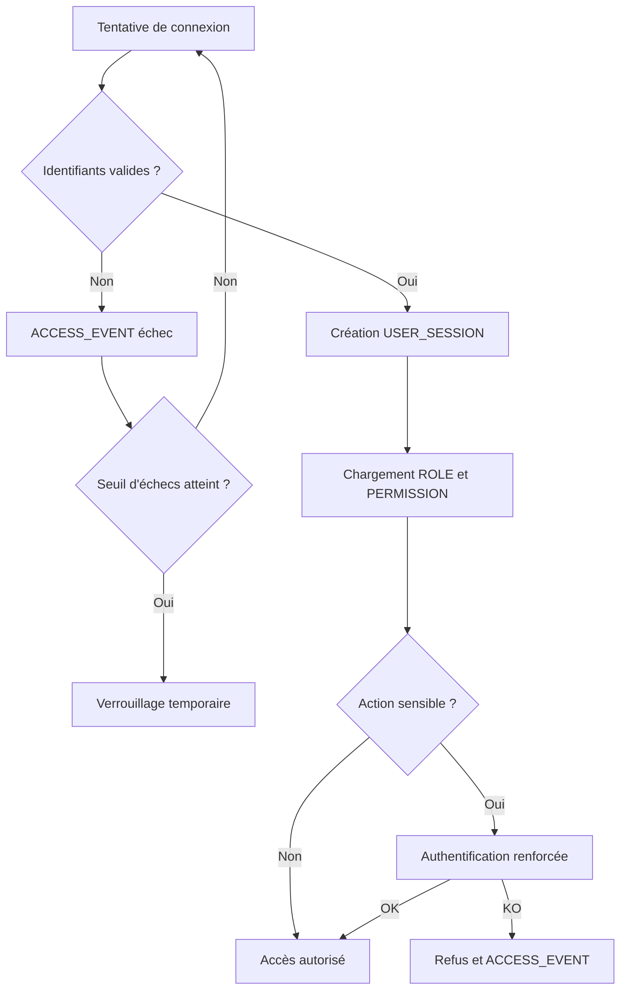
```mermaid
flowchart TD
    A[Tentative de connexion] --> B{Identifiants valides ?}
    B -->|Non| C[ACCESS_EVENT échec]
    C --> D{Seuil d'échecs atteint ?}
    D -->|Oui| E[Verrouillage temporaire]
    D -->|Non| A
    B -->|Oui| F[Création USER_SESSION]
    F --> G[Chargement ROLE et PERMISSION]
    G --> H{Action sensible ?}
    H -->|Non| I[Accès autorisé]
    H -->|Oui| J[Authentification renforcée]
    J -->|OK| I
    J -->|KO| K[Refus et ACCESS_EVENT]
```
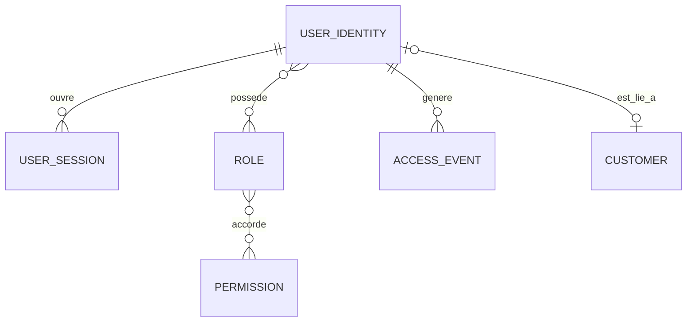
```mermaid
erDiagram
    USER_IDENTITY ||--o{ USER_SESSION : ouvre
    USER_IDENTITY }o--o{ ROLE : possede
    ROLE }o--o{ PERMISSION : accorde
    USER_IDENTITY ||--o{ ACCESS_EVENT : genere
    USER_IDENTITY |o--o| CUSTOMER : est_lie_a
```

## Cœur 2 – Cycle de vie client

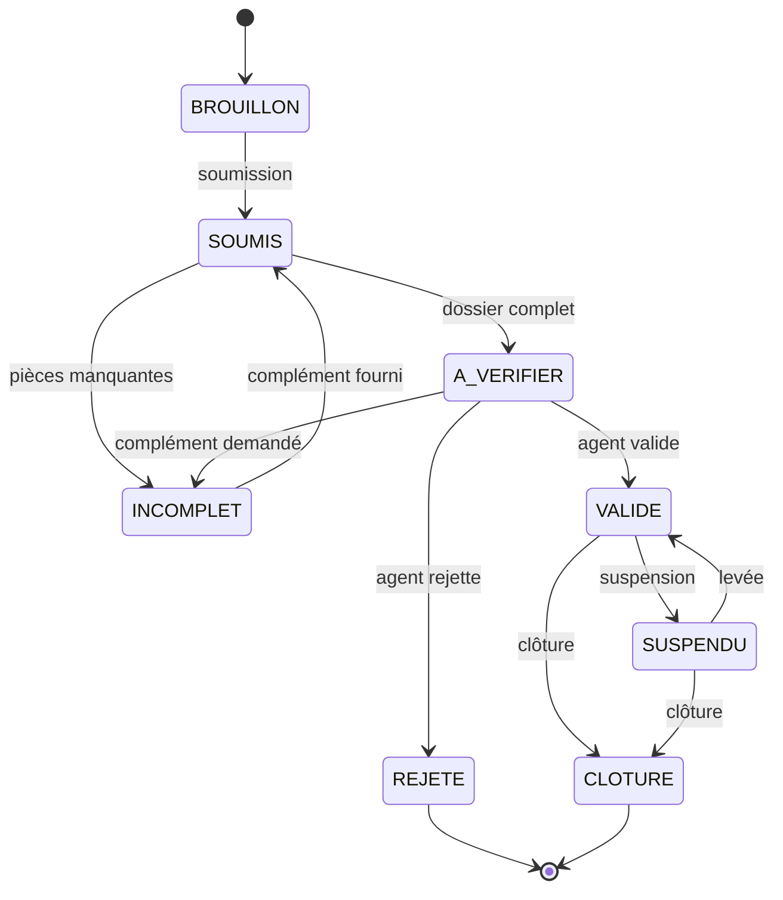
```mermaid
stateDiagram-v2
    [*] --> BROUILLON
    BROUILLON --> SOUMIS : soumission
    SOUMIS --> A_VERIFIER : dossier complet
    SOUMIS --> INCOMPLET : pièces manquantes
    A_VERIFIER --> INCOMPLET : complément demandé
    INCOMPLET --> SOUMIS : complément fourni
    A_VERIFIER --> VALIDE : agent valide
    A_VERIFIER --> REJETE : agent rejette
    VALIDE --> SUSPENDU : suspension
    SUSPENDU --> VALIDE : levée
    VALIDE --> CLOTURE : clôture
    SUSPENDU --> CLOTURE : clôture
    REJETE --> [*]
    CLOTURE --> [*]
```
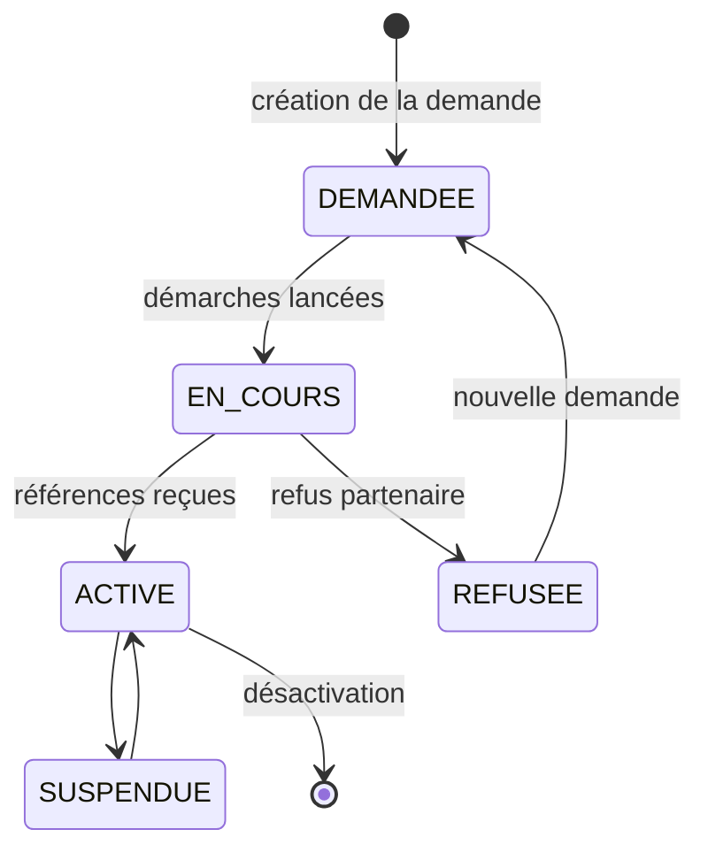
```mermaid
stateDiagram-v2
    [*] --> DEMANDEE : création de la demande
    DEMANDEE --> EN_COURS : démarches lancées
    EN_COURS --> ACTIVE : références reçues
    EN_COURS --> REFUSEE : refus partenaire
    ACTIVE --> SUSPENDUE
    SUSPENDUE --> ACTIVE
    REFUSEE --> DEMANDEE : nouvelle demande
    ACTIVE --> [*] : désactivation
```
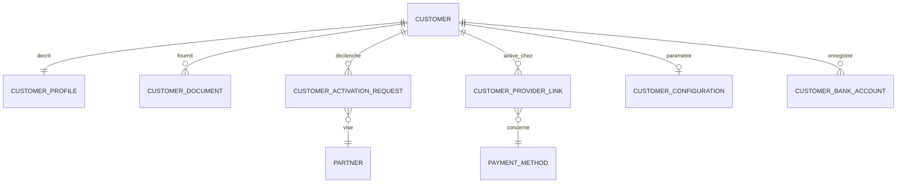
```mermaid
erDiagram
    CUSTOMER ||--|| CUSTOMER_PROFILE : decrit
    CUSTOMER ||--o{ CUSTOMER_DOCUMENT : fournit
    CUSTOMER ||--o{ CUSTOMER_ACTIVATION_REQUEST : declenche
    CUSTOMER ||--o{ CUSTOMER_PROVIDER_LINK : active_chez
    CUSTOMER ||--o| CUSTOMER_CONFIGURATION : parametre
    CUSTOMER_PROVIDER_LINK }o--|| PAYMENT_METHOD : concerne
    CUSTOMER_ACTIVATION_REQUEST }o--|| PARTNER : vise
    CUSTOMER ||--o{ CUSTOMER_BANK_ACCOUNT : enregistre
```

## Cœur 3 – Référentiel des partenaires et méthodes

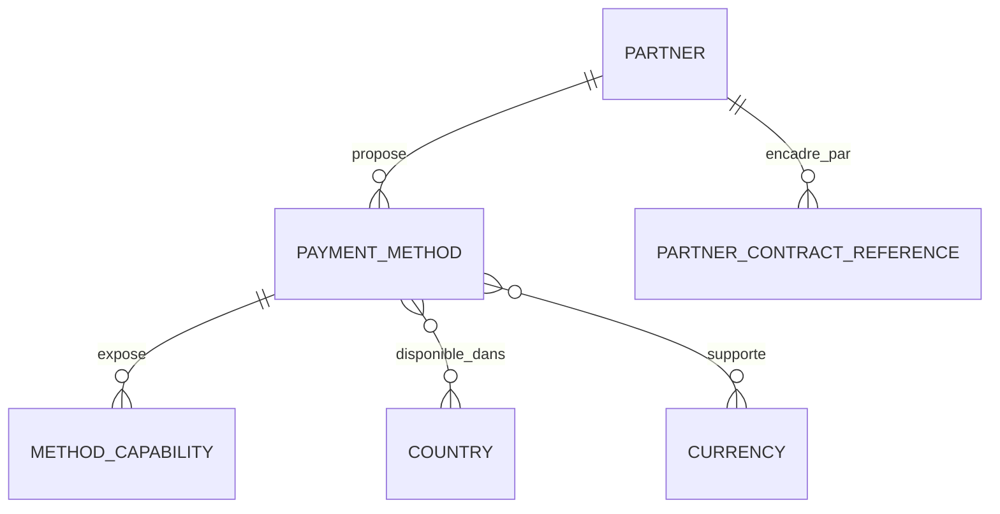
```mermaid
erDiagram
    PARTNER ||--o{ PAYMENT_METHOD : propose
    PARTNER ||--o{ PARTNER_CONTRACT_REFERENCE : encadre_par
    PAYMENT_METHOD ||--o{ METHOD_CAPABILITY : expose
    PAYMENT_METHOD }o--o{ COUNTRY : disponible_dans
    PAYMENT_METHOD }o--o{ CURRENCY : supporte
```
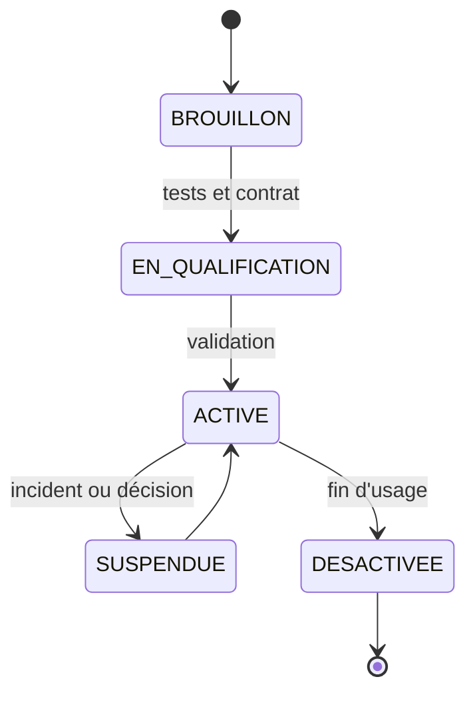
```mermaid
stateDiagram-v2
    [*] --> BROUILLON
    BROUILLON --> EN_QUALIFICATION : tests et contrat
    EN_QUALIFICATION --> ACTIVE : validation
    ACTIVE --> SUSPENDUE : incident ou décision
    SUSPENDUE --> ACTIVE
    ACTIVE --> DESACTIVEE : fin d'usage
    DESACTIVEE --> [*]
```
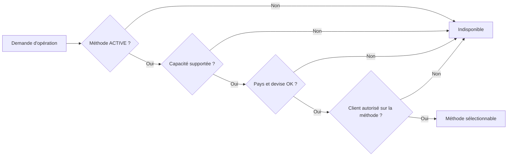
```mermaid
flowchart LR
    R[Demande d'opération] --> S{Méthode ACTIVE ?}
    S -->|Non| X[Indisponible]
    S -->|Oui| T{Capacité supportée ?}
    T -->|Non| X
    T -->|Oui| U{Pays et devise OK ?}
    U -->|Non| X
    U -->|Oui| V{Client autorisé sur la méthode ?}
    V -->|Non| X
    V -->|Oui| W[Méthode sélectionnable]
```

## Cœur 4 – Configuration des intégrations partenaires

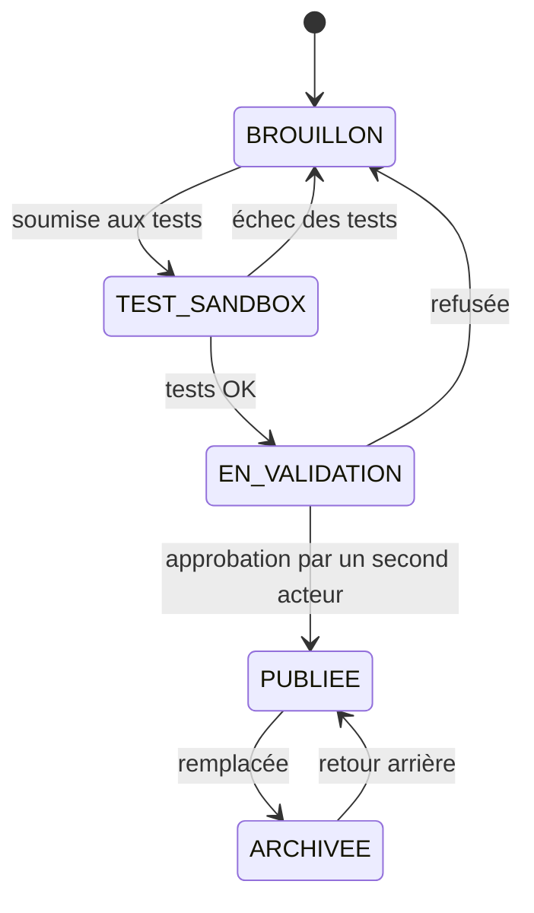
```mermaid
stateDiagram-v2
    [*] --> BROUILLON
    BROUILLON --> TEST_SANDBOX : soumise aux tests
    TEST_SANDBOX --> BROUILLON : échec des tests
    TEST_SANDBOX --> EN_VALIDATION : tests OK
    EN_VALIDATION --> PUBLIEE : approbation par un second acteur
    EN_VALIDATION --> BROUILLON : refusée
    PUBLIEE --> ARCHIVEE : remplacée
    ARCHIVEE --> PUBLIEE : retour arrière
```
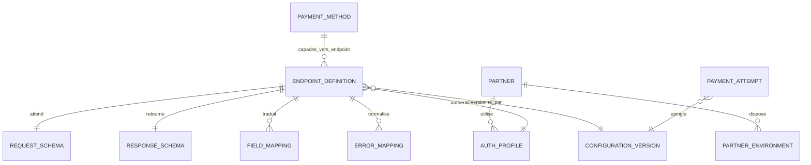
```mermaid
erDiagram
    PARTNER ||--o{ PARTNER_ENVIRONMENT : dispose
    PARTNER ||--o{ AUTH_PROFILE : utilise
    PAYMENT_METHOD ||--o{ ENDPOINT_DEFINITION : capacite_vers_endpoint
    ENDPOINT_DEFINITION ||--|| REQUEST_SCHEMA : attend
    ENDPOINT_DEFINITION ||--|| RESPONSE_SCHEMA : retourne
    ENDPOINT_DEFINITION ||--o{ FIELD_MAPPING : traduit
    ENDPOINT_DEFINITION ||--o{ ERROR_MAPPING : normalise
    ENDPOINT_DEFINITION }o--|| AUTH_PROFILE : authentifie_par
    ENDPOINT_DEFINITION }o--|| CONFIGURATION_VERSION : versionne_par
    PAYMENT_ATTEMPT }o--|| CONFIGURATION_VERSION : epingle
```
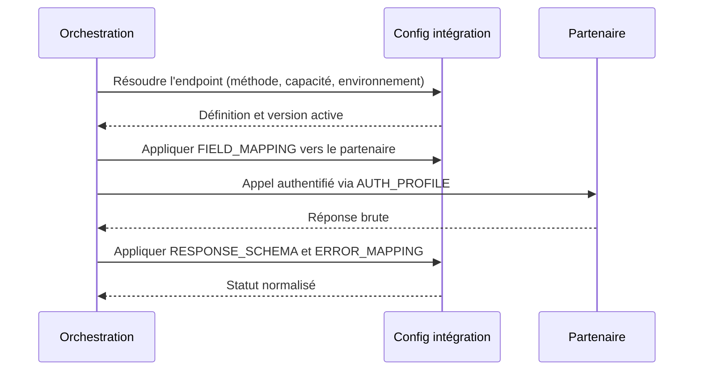
```mermaid
sequenceDiagram
    participant ORC as Orchestration
    participant CFG as Config intégration
    participant P as Partenaire
    ORC->>CFG: Résoudre l'endpoint (méthode, capacité, environnement)
    CFG-->>ORC: Définition et version active
    ORC->>CFG: Appliquer FIELD_MAPPING vers le partenaire
    ORC->>P: Appel authentifié via AUTH_PROFILE
    P-->>ORC: Réponse brute
    ORC->>CFG: Appliquer RESPONSE_SCHEMA et ERROR_MAPPING
    CFG-->>ORC: Statut normalisé
```

## Cœur 5 – Orchestration des paiements

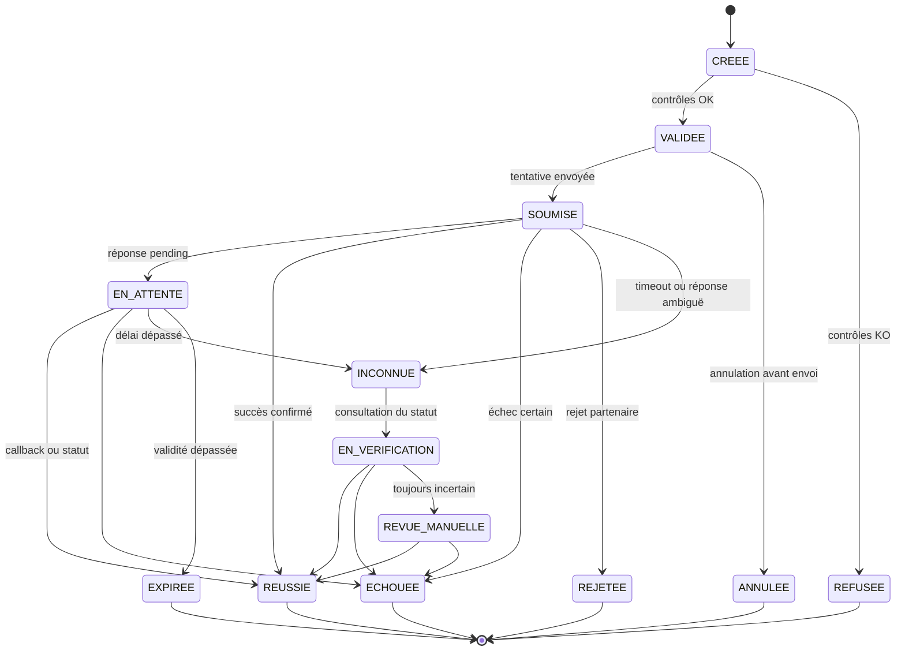
```mermaid
stateDiagram-v2
    [*] --> CREEE
    CREEE --> VALIDEE : contrôles OK
    CREEE --> REFUSEE : contrôles KO
    VALIDEE --> SOUMISE : tentative envoyée
    VALIDEE --> ANNULEE : annulation avant envoi
    SOUMISE --> EN_ATTENTE : réponse pending
    SOUMISE --> REUSSIE : succès confirmé
    SOUMISE --> ECHOUEE : échec certain
    SOUMISE --> REJETEE : rejet partenaire
    SOUMISE --> INCONNUE : timeout ou réponse ambiguë
    EN_ATTENTE --> REUSSIE : callback ou statut
    EN_ATTENTE --> ECHOUEE
    EN_ATTENTE --> INCONNUE : délai dépassé
    EN_ATTENTE --> EXPIREE : validité dépassée
    INCONNUE --> EN_VERIFICATION : consultation du statut
    EN_VERIFICATION --> REUSSIE
    EN_VERIFICATION --> ECHOUEE
    EN_VERIFICATION --> REVUE_MANUELLE : toujours incertain
    REVUE_MANUELLE --> REUSSIE
    REVUE_MANUELLE --> ECHOUEE
    REUSSIE --> [*]
    ECHOUEE --> [*]
    REJETEE --> [*]
    REFUSEE --> [*]
    ANNULEE --> [*]
    EXPIREE --> [*]
```
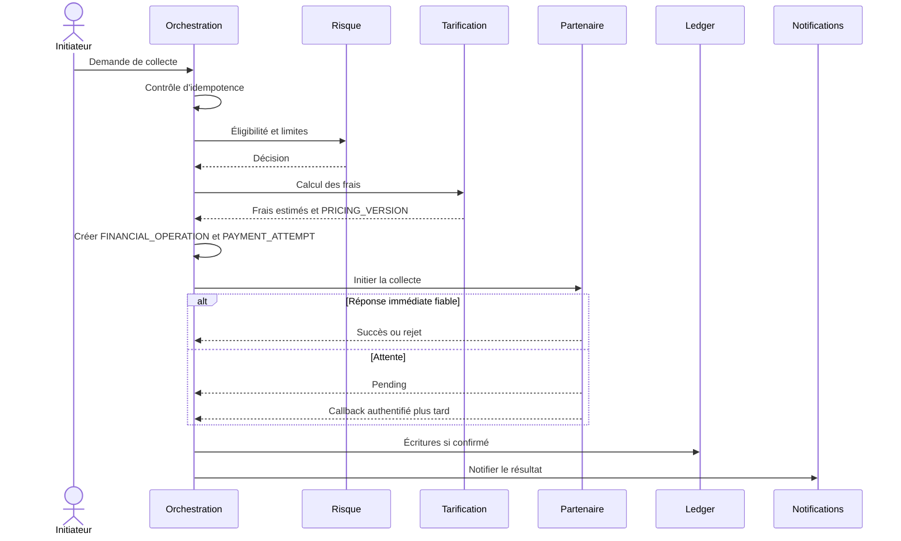
```mermaid
sequenceDiagram
    actor C as Initiateur
    participant ORC as Orchestration
    participant RISK as Risque
    participant FEE as Tarification
    participant P as Partenaire
    participant LED as Ledger
    participant NOT as Notifications
    C->>ORC: Demande de collecte
    ORC->>ORC: Contrôle d'idempotence
    ORC->>RISK: Éligibilité et limites
    RISK-->>ORC: Décision
    ORC->>FEE: Calcul des frais
    FEE-->>ORC: Frais estimés et PRICING_VERSION
    ORC->>ORC: Créer FINANCIAL_OPERATION et PAYMENT_ATTEMPT
    ORC->>P: Initier la collecte
    alt Réponse immédiate fiable
        P-->>ORC: Succès ou rejet
    else Attente
        P-->>ORC: Pending
        P-->>ORC: Callback authentifié plus tard
    end
    ORC->>LED: Écritures si confirmé
    ORC->>NOT: Notifier le résultat
```
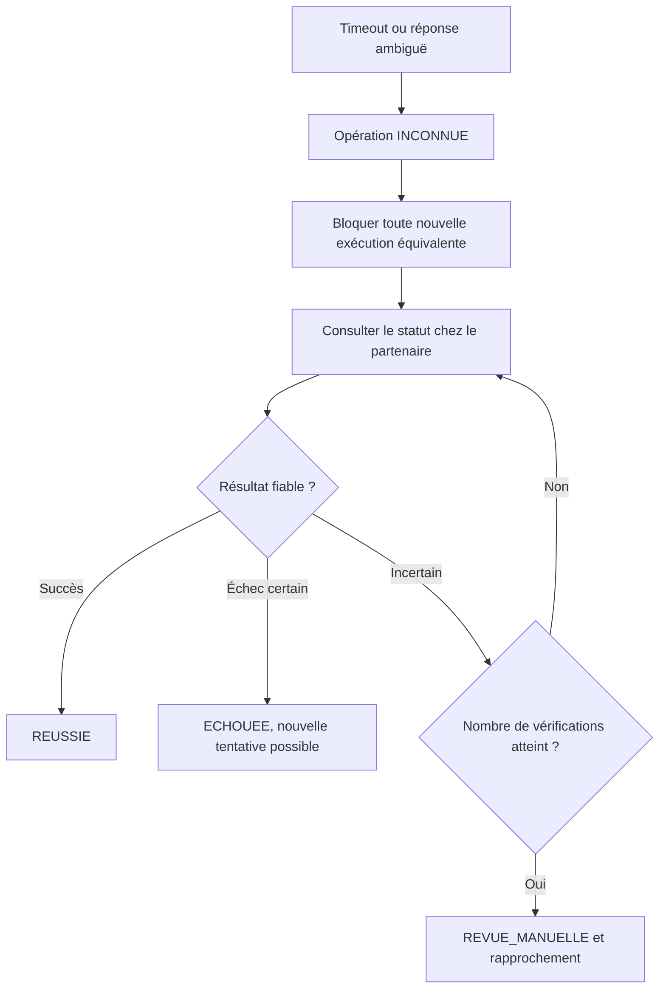
```mermaid
flowchart TD
    T[Timeout ou réponse ambiguë] --> U[Opération INCONNUE]
    U --> V[Bloquer toute nouvelle exécution équivalente]
    V --> W[Consulter le statut chez le partenaire]
    W --> X{Résultat fiable ?}
    X -->|Succès| Y[REUSSIE]
    X -->|Échec certain| Z[ECHOUEE, nouvelle tentative possible]
    X -->|Incertain| AA{Nombre de vérifications atteint ?}
    AA -->|Non| W
    AA -->|Oui| AB[REVUE_MANUELLE et rapprochement]
```
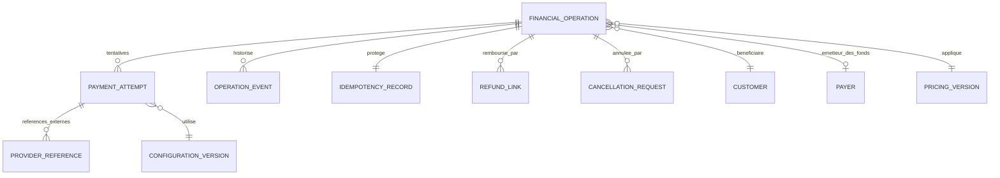
```mermaid
erDiagram
    FINANCIAL_OPERATION ||--o{ PAYMENT_ATTEMPT : tentatives
    FINANCIAL_OPERATION ||--o{ OPERATION_EVENT : historise
    FINANCIAL_OPERATION ||--|| IDEMPOTENCY_RECORD : protege
    PAYMENT_ATTEMPT ||--o{ PROVIDER_REFERENCE : references_externes
    FINANCIAL_OPERATION ||--o{ REFUND_LINK : rembourse_par
    FINANCIAL_OPERATION ||--o{ CANCELLATION_REQUEST : annulee_par
    FINANCIAL_OPERATION }o--|| CUSTOMER : beneficiaire
    FINANCIAL_OPERATION }o--o| PAYER : emetteur_des_fonds
    PAYMENT_ATTEMPT }o--|| CONFIGURATION_VERSION : utilise
    FINANCIAL_OPERATION }o--|| PRICING_VERSION : applique
```

## Cœur 6 – Comptes clients et comptabilité interne

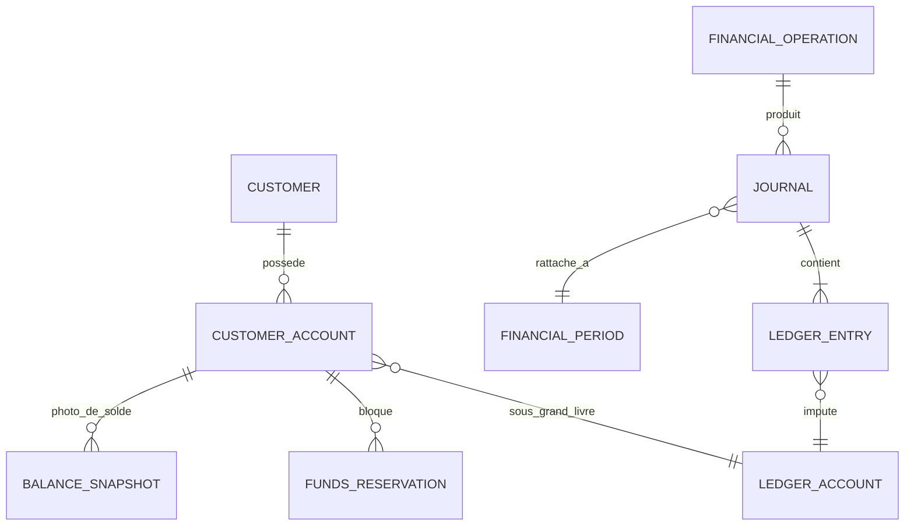
```mermaid
erDiagram
    CUSTOMER ||--o{ CUSTOMER_ACCOUNT : possede
    CUSTOMER_ACCOUNT }o--|| LEDGER_ACCOUNT : sous_grand_livre
    JOURNAL ||--|{ LEDGER_ENTRY : contient
    LEDGER_ENTRY }o--|| LEDGER_ACCOUNT : impute
    FINANCIAL_OPERATION ||--o{ JOURNAL : produit
    CUSTOMER_ACCOUNT ||--o{ FUNDS_RESERVATION : bloque
    CUSTOMER_ACCOUNT ||--o{ BALANCE_SNAPSHOT : photo_de_solde
    JOURNAL }o--|| FINANCIAL_PERIOD : rattache_a
```
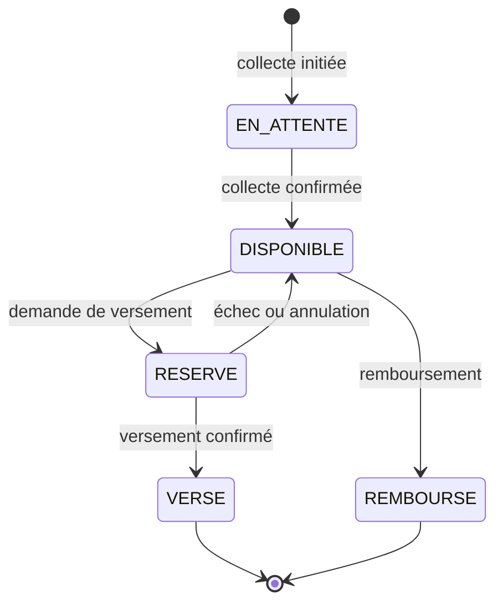
```mermaid
stateDiagram-v2
    [*] --> EN_ATTENTE : collecte initiée
    EN_ATTENTE --> DISPONIBLE : collecte confirmée
    DISPONIBLE --> RESERVE : demande de versement
    RESERVE --> DISPONIBLE : échec ou annulation
    RESERVE --> VERSE : versement confirmé
    DISPONIBLE --> REMBOURSE : remboursement
    VERSE --> [*]
    REMBOURSE --> [*]
```
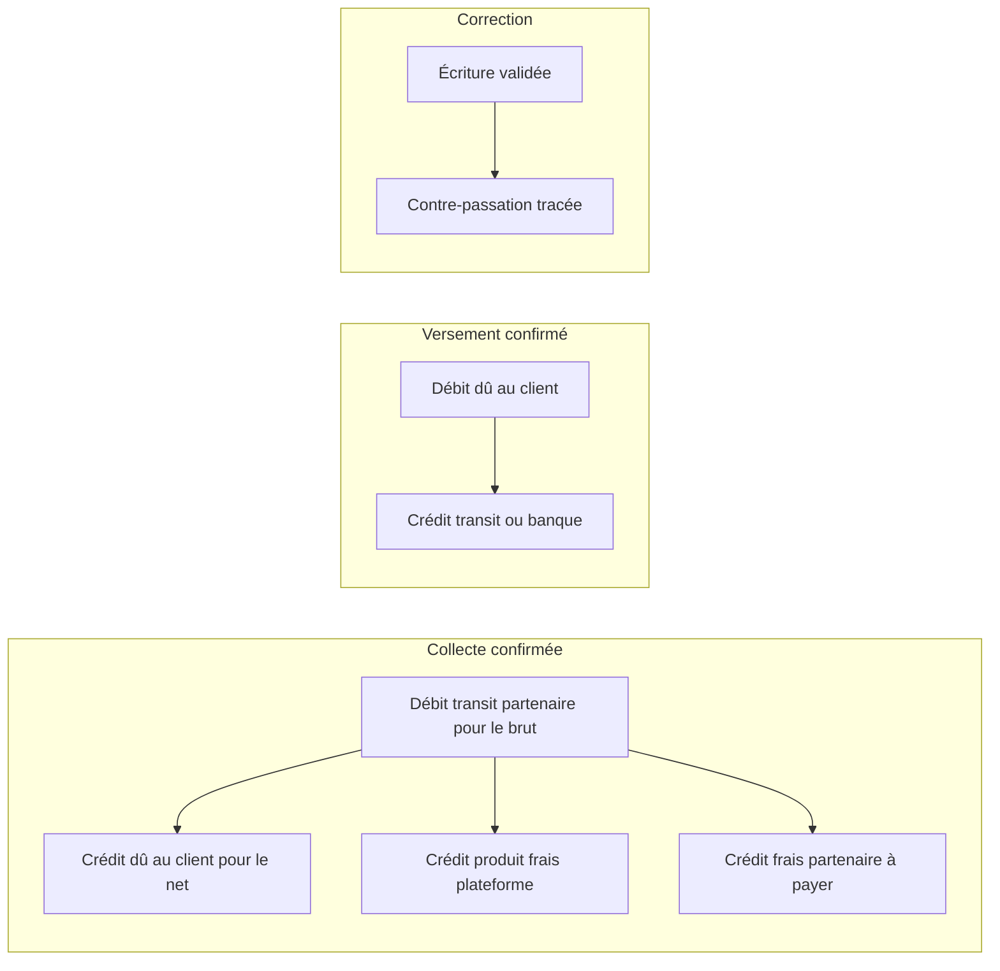
```mermaid
flowchart LR
    subgraph K [Collecte confirmée]
        A[Débit transit partenaire pour le brut] --> B[Crédit dû au client pour le net]
        A --> C[Crédit produit frais plateforme]
        A --> D[Crédit frais partenaire à payer]
    end
    subgraph V [Versement confirmé]
        E[Débit dû au client] --> F[Crédit transit ou banque]
    end
    subgraph X [Correction]
        G[Écriture validée] --> H[Contre-passation tracée]
    end
```

## Cœur 7 – Versements et décaissements

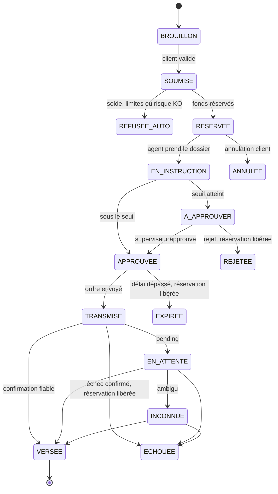
```mermaid
stateDiagram-v2
    [*] --> BROUILLON
    BROUILLON --> SOUMISE : client valide
    SOUMISE --> REFUSEE_AUTO : solde, limites ou risque KO
    SOUMISE --> RESERVEE : fonds réservés
    RESERVEE --> EN_INSTRUCTION : agent prend le dossier
    RESERVEE --> ANNULEE : annulation client
    EN_INSTRUCTION --> A_APPROUVER : seuil atteint
    EN_INSTRUCTION --> APPROUVEE : sous le seuil
    A_APPROUVER --> APPROUVEE : superviseur approuve
    A_APPROUVER --> REJETEE : rejet, réservation libérée
    APPROUVEE --> TRANSMISE : ordre envoyé
    APPROUVEE --> EXPIREE : délai dépassé, réservation libérée
    TRANSMISE --> VERSEE : confirmation fiable
    TRANSMISE --> ECHOUEE : échec confirmé, réservation libérée
    TRANSMISE --> EN_ATTENTE : pending
    EN_ATTENTE --> VERSEE
    EN_ATTENTE --> ECHOUEE
    EN_ATTENTE --> INCONNUE : ambigu
    INCONNUE --> VERSEE
    INCONNUE --> ECHOUEE
    VERSEE --> [*]
```
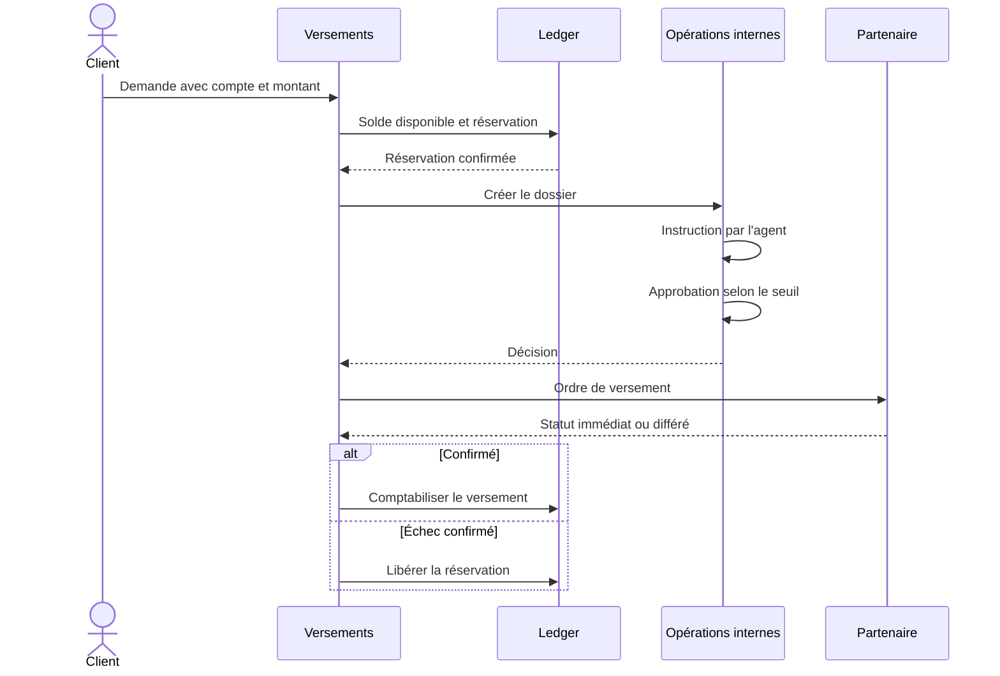
```mermaid
sequenceDiagram
    actor Cl as Client
    participant PAY as Versements
    participant LED as Ledger
    participant OPS as Opérations internes
    participant P as Partenaire
    Cl->>PAY: Demande avec compte et montant
    PAY->>LED: Solde disponible et réservation
    LED-->>PAY: Réservation confirmée
    PAY->>OPS: Créer le dossier
    OPS->>OPS: Instruction par l'agent
    OPS->>OPS: Approbation selon le seuil
    OPS-->>PAY: Décision
    PAY->>P: Ordre de versement
    P-->>PAY: Statut immédiat ou différé
    alt Confirmé
        PAY->>LED: Comptabiliser le versement
    else Échec confirmé
        PAY->>LED: Libérer la réservation
    end
```
```mermaid
stateDiagram-v2
    [*] --> A_VERIFIER : ajout par le client
    A_VERIFIER --> VERIFIE : vérification par un agent
    A_VERIFIER --> REFUSE : vérification échouée
    VERIFIE --> A_VERIFIER : coordonnées modifiées
    VERIFIE --> SUSPENDU : alerte risque
    SUSPENDU --> VERIFIE : levée
    VERIFIE --> RETIRE : retrait par le client
    REFUSE --> [*]
    RETIRE --> [*]
```
```mermaid
erDiagram
    PAYOUT_REQUEST }o--|| CUSTOMER_BANK_ACCOUNT : vers
    CUSTOMER_BANK_ACCOUNT }o--|| BANK : dans
    CUSTOMER_BANK_ACCOUNT ||--|| BENEFICIARY : au_nom_de
    PAYOUT_REQUEST ||--o{ PAYOUT_APPROVAL : approuvee_par
    PAYOUT_REQUEST ||--o{ PAYOUT_ATTEMPT : executee_par
    PAYOUT_REQUEST ||--o{ PAYOUT_EVENT : historise
    PAYOUT_ATTEMPT }o--|| CONFIGURATION_VERSION : utilise
```

## Cœur 8 – Tarification, frais et commissions

```mermaid
flowchart TD
    A[Opération initiée] --> B[Sélection de la PRICING_VERSION datée]
    B --> C{Tarif négocié pour ce client ?}
    C -->|Oui| D[CUSTOMER_FEE]
    C -->|Non| E[FEE_POLICY standard]
    D --> F[Appliquer FEE_RULE fixe, proportionnel, minimum, maximum]
    E --> F
    F --> G[Arrondi]
    G --> H[FEE_CALCULATION estimée liée à l'opération]
    H --> I[Retour partenaire ou rapprochement]
    I --> J{Frais réels égaux aux estimés ?}
    J -->|Oui| K[Confirmer]
    J -->|Non| L[Écart de frais, ajustement via le Ledger]
```
```mermaid
erDiagram
    FEE_POLICY ||--o{ FEE_RULE : contient
    FEE_POLICY }o--|| PRICING_VERSION : versionnee
    PARTNER ||--o{ PARTNER_FEE : facture
    CUSTOMER ||--o{ CUSTOMER_FEE : tarif_negocie
    FINANCIAL_OPERATION ||--o{ FEE_CALCULATION : frais_calcules
    FEE_CALCULATION }o--|| PRICING_VERSION : utilise
```

## Cœur 9 – Risque, conformité et éligibilité

```mermaid
flowchart TD
    A[Demande d'activation, de collecte ou de versement] --> B{Client ACTIVE sur la méthode ?}
    B -->|Non| R[REFUSER]
    B -->|Oui| C{Restriction en vigueur ?}
    C -->|Oui| R
    C -->|Non| D{Limites respectées ?}
    D -->|Non| R
    D -->|Oui| E{Signal d'alerte ?}
    E -->|Non| OK[AUTORISER]
    E -->|Oui| F[RISK_ALERT et COMPLIANCE_REVIEW]
    F --> G{Décision de la revue}
    G -->|Accepter| OK
    G -->|Rejeter| R
    G -->|Limiter ou différer| L[DIFFERER ou LIMITER]
```
```mermaid
erDiagram
    CUSTOMER ||--o{ KYC_CHECK : subit
    CUSTOMER ||--o{ RESTRICTION : peut_avoir
    ELIGIBILITY_RULE ||--o{ TRANSACTION_LIMIT : definit
    FINANCIAL_OPERATION ||--o{ RISK_ALERT : peut_declencher
    RISK_ALERT ||--o| COMPLIANCE_REVIEW : instruite_par
```

## Cœur 10 – Opérations internes et gestion des dossiers

```mermaid
stateDiagram-v2
    [*] --> NOUVEAU
    NOUVEAU --> AFFECTE : assignation
    AFFECTE --> EN_COURS : prise en charge
    EN_COURS --> EN_ATTENTE_EXTERNE : information attendue
    EN_ATTENTE_EXTERNE --> EN_COURS
    EN_COURS --> A_APPROUVER : validation requise
    A_APPROUVER --> RESOLU : approuvé
    A_APPROUVER --> EN_COURS : rejeté ou complément
    EN_COURS --> ESCALADE : échéance ou complexité
    ESCALADE --> EN_COURS : réaffecté
    EN_COURS --> RESOLU
    RESOLU --> CLOS
    CLOS --> [*]
```
```mermaid
flowchart LR
    A[Instruction par l'agent] --> B{Seuil de montant ou de risque atteint ?}
    B -->|Non| C[Décision de l'agent]
    B -->|Oui| D[Approbation par un superviseur différent du demandeur et de l'instructeur]
    C --> E[DECISION_RECORD]
    D --> E
```
```mermaid
erDiagram
    WORK_ITEM }o--o| CASE : regroupe_dans
    WORK_ITEM ||--o{ CASE_ASSIGNMENT : affecte
    WORK_ITEM ||--o{ APPROVAL : soumis_a
    WORK_ITEM ||--o{ REVIEW_COMMENT : annote
    WORK_ITEM ||--o{ DECISION_RECORD : decisions
    WORK_ITEM }o--|| SLA_TARGET : echeance
```

## Cœur 11 – Rapprochement et règlement financier

```mermaid
flowchart TD
    A[Import du PROVIDER_STATEMENT] --> B[Normalisation des lignes]
    B --> C[Appariement avec les opérations internes]
    C --> D{MATCH_RESULT}
    D -->|Identique| E[Rapproché]
    D -->|Absent chez nous| F[Écart opération manquante en interne]
    D -->|Absent chez le partenaire| G[Écart opération manquante chez le partenaire]
    D -->|Montant différent| H[Écart de montant]
    D -->|Statut divergent| I[Écart de statut]
    D -->|Doublon| J[Écart doublon]
    D -->|Frais non conformes| K[Écart de frais]
    F --> L[RECONCILIATION_CASE]
    G --> L
    H --> L
    I --> L
    J --> L
    K --> L
    L --> M[Correction autorisée par opération ou écriture]
    M --> N[Cas clos]
```
```mermaid
stateDiagram-v2
    [*] --> OUVERT
    OUVERT --> EN_ANALYSE
    EN_ANALYSE --> CORRECTION_PROPOSEE
    CORRECTION_PROPOSEE --> CORRIGE : correction autorisée
    EN_ANALYSE --> ACCEPTE : écart toléré et justifié
    CORRIGE --> CLOS
    ACCEPTE --> CLOS
    CLOS --> [*]
```
```mermaid
erDiagram
    RECONCILIATION_BATCH ||--o{ PROVIDER_STATEMENT : importe
    PROVIDER_STATEMENT ||--o{ MATCH_RESULT : produit
    MATCH_RESULT }o--o| FINANCIAL_OPERATION : apparie
    MATCH_RESULT ||--o| RECONCILIATION_CASE : ouvre_si_ecart
    SETTLEMENT ||--o{ SETTLEMENT_REFERENCE : references
    PROVIDER_STATEMENT }o--o| SETTLEMENT : reglement_associe
```

## Cœur 12 – Notifications, webhooks et reporting

```mermaid
flowchart LR
    E[Événement établi par un domaine] --> T{Règle de notification ?}
    T -->|Non| X[Ignoré]
    T -->|Oui| U[Choix du destinataire et des préférences]
    U --> V[NOTIFICATION_TEMPLATE]
    V --> W[Envoi par canal]
    W --> Y{Livré ?}
    Y -->|Oui| Z[DELIVERY_ATTEMPT succès]
    Y -->|Non| R{Nouvel essai possible ?}
    R -->|Oui| W
    R -->|Non| F[Échec tracé et alerte]
```
```mermaid
erDiagram
    NOTIFICATION ||--|| NOTIFICATION_TEMPLATE : modele
    NOTIFICATION ||--o{ DELIVERY_ATTEMPT : tentatives_d_envoi
    WEBHOOK_SUBSCRIPTION ||--o{ DELIVERY_ATTEMPT : livraisons
    REPORT_DEFINITION ||--o{ KPI_SNAPSHOT : produit
```

## Cœur 13 – Audit et traçabilité (ajouté)

```mermaid
flowchart LR
    A[Action sensible ou changement d'état] --> B[Domaine propriétaire exécute l'action]
    B --> C[Émission d'un AUDIT_EVENT]
    C --> D[Stockage en ajout seul, sans modification ni suppression]
    D --> E[Consultation par rôle autorisé]
    D --> F[Preuves pour revue, litige et conformité]
```
```mermaid
erDiagram
    AUDIT_EVENT }o--|| USER_IDENTITY : acteur
    AUDIT_EVENT }o--o| AUDIT_OBJECT_REF : porte_sur
    AUDIT_EVENT ||--o| AUDIT_JUSTIFICATION : motive_par
```

## Cœur 14 – Litiges et contestations (ajouté)

```mermaid
stateDiagram-v2
    [*] --> OUVERT : contestation reçue
    OUVERT --> QUALIFIE : opération identifiée et recevable
    OUVERT --> IRRECEVABLE : hors périmètre
    QUALIFIE --> EN_INSTRUCTION
    EN_INSTRUCTION --> REMBOURSEMENT_DECIDE : fondé
    EN_INSTRUCTION --> REFUSE : non fondé
    EN_INSTRUCTION --> ESCALADE_PARTENAIRE : traitement chez le partenaire
    ESCALADE_PARTENAIRE --> REMBOURSEMENT_DECIDE
    ESCALADE_PARTENAIRE --> REFUSE
    REMBOURSEMENT_DECIDE --> EXECUTE : remboursement ou contre-passation réalisé
    EXECUTE --> CLOS
    REFUSE --> CLOS
    IRRECEVABLE --> CLOS
    CLOS --> [*]
```
```mermaid
erDiagram
    DISPUTE }o--|| FINANCIAL_OPERATION : conteste
    DISPUTE ||--o{ DISPUTE_EVENT : historise
    DISPUTE ||--o| WORK_ITEM : instruit_par
    DISPUTE ||--o{ REFUND_LINK : debouche_sur
```

## Modèle conceptuel unifié

Ce diagramme réunit les principales relations conceptuelles entre les domaines, y compris les objets ajoutés dans la v0.2.

```mermaid
erDiagram
    PARTNER ||--o{ PAYMENT_METHOD : propose
    PAYMENT_METHOD ||--o{ METHOD_CAPABILITY : expose
    PAYMENT_METHOD ||--o{ ENDPOINT_DEFINITION : implemente
    CUSTOMER ||--o{ CUSTOMER_PROVIDER_LINK : active_chez
    CUSTOMER_PROVIDER_LINK }o--|| PAYMENT_METHOD : concerne
    CUSTOMER ||--o{ CUSTOMER_ACCOUNT : possede
    CUSTOMER ||--o{ CUSTOMER_BANK_ACCOUNT : enregistre
    CUSTOMER ||--o{ FINANCIAL_OPERATION : beneficie
    PAYER ||--o{ FINANCIAL_OPERATION : emet
    FINANCIAL_OPERATION ||--o{ PAYMENT_ATTEMPT : tentatives
    FINANCIAL_OPERATION ||--o{ OPERATION_EVENT : historise
    FINANCIAL_OPERATION ||--o{ JOURNAL : comptabilise
    FINANCIAL_OPERATION ||--o{ FEE_CALCULATION : frais
    FINANCIAL_OPERATION ||--o{ REFUND_LINK : rembourse_par
    JOURNAL ||--|{ LEDGER_ENTRY : contient
    CUSTOMER_ACCOUNT ||--o{ FUNDS_RESERVATION : bloque
    PAYOUT_REQUEST }o--|| CUSTOMER_BANK_ACCOUNT : vers
    PAYOUT_REQUEST ||--o{ PAYOUT_ATTEMPT : executee_par
    PAYOUT_REQUEST ||--o| FUNDS_RESERVATION : reserve
    DISPUTE }o--|| FINANCIAL_OPERATION : conteste
    MATCH_RESULT }o--o| FINANCIAL_OPERATION : apparie
    AUDIT_EVENT }o--o| FINANCIAL_OPERATION : trace
```

---

# Réserves, points à arbitrer et pistes de solution

Cette partie rassemble les sujets qui ne sont pas encore suffisamment déterminés pour être considérés comme des règles acquises. Les pistes proposées sont des options de travail, pas des décisions déjà validées. Les valeurs chiffrées (plafonds, délais, seuils, durées de conservation et SLA) restent à fixer avec les partenaires et les responsables métier.

## B.1 Réserves par cœur métier

### Cœur 1 – Identité et contrôle des accès

- Politique MFA, récupération de compte, durée de session.
- Statut de l'identité avant validation du dossier : connexion possible en BROUILLON ?
- Départ d'un collaborateur : désactivation immédiate et revue périodique des droits.
- Délégation temporaire et accès d'urgence.
- Liste précise des actions sensibles.

### Cœur 2 – Cycle de vie client

- Critères de détection des doublons d'identité.
- Expiration des pièces et fréquence du réexamen périodique.
- Consentement, conservation et effacement des données face aux obligations de conservation.

### Cœur 3 – Référentiel des partenaires et méthodes

- Plafonds par capacité : ici ou dans le cœur 9 ?
- Un remboursement partiel est-il une capacité distincte du remboursement total ?
- Historique des conditions contractuelles par période.

### Cœur 4 – Configuration des intégrations partenaires

- Rotation des secrets et des certificats, expiration des accès partenaires.
- Mécanisme d'authenticité des callbacks (signature, liste d'adresses autorisées).
- Limites d'appels du partenaire et délais d'attente par capacité.

### Cœur 5 – Orchestration des paiements

- Qui initie la collecte (client, lien envoyé au payeur, opérateur, système tiers) : décision du §10 de la v0.1, qui change le parcours d'entrée.
- Durée de validité d'une collecte en attente et cadence des vérifications.
- Course entre réponse synchrone et callback : l'ordre d'arrivée ne doit pas changer le résultat (RP-01 pose le principe, le mécanisme reste à écrire).
- Données conservées sur le PAYER et leur durée.

### Cœur 6 – Comptes clients et comptabilité interne

- Plan comptable, comptes de transit et de suspens.
- Délai éventuel entre confirmation et disponibilité des fonds.
- Solde négatif possible (remboursement ou contestation après versement) : qui supporte le risque ?
- Multi-devises, arrondis et conversions. Clôture de période et modifications après clôture. Taxes éventuelles sur les frais.
- Ces diagrammes supposent le modèle « suivi comptable ». Ils sont à revoir selon la décision sur la détention des fonds.

### Cœur 7 – Versements et décaissements

- Procédure concrète de vérification du compte bancaire (preuve demandée, qui la contrôle).
- Seuils d'approbation et règles de délégation chiffrés. Délai de carence après changement de coordonnées.
- Frais déduits du montant demandé ou ajoutés ?
- Versement manuel hors partenaire : preuve de paiement et rapprochement. Retour bancaire tardif après un succès apparent. Versement partiel ou groupé.

### Cœur 8 – Tarification, frais et commissions

- Qui supporte quels frais (client, payeur, plateforme).
- Frais d'une opération remboursée : rendus, conservés ou partagés ?
- Barèmes distincts collecte et versement. Taxes et arrondis par devise.
- Moment où le coût est affiché puis figé pour le client.

### Cœur 9 – Risque, conformité et éligibilité

- Niveaux de KYC éventuels, associés à des plafonds différents.
- Contrôles de listes et de sanctions : à qualifier avec la conformité.
- Obligations réglementaires locales (zone CEMAC envisagée) : à valider juridiquement, rien n'est présumé ici.
- Gel d'un client ou d'un montant sur décision d'une autorité. Conservation des preuves de décision.

### Cœur 10 – Opérations internes et gestion des dossiers

- Catalogue des types de dossiers et priorités (activation, versement, anomalie, écart, litige, support).
- Valeurs de SLA, règles d'escalade, gestion des absences.

### Cœur 11 – Rapprochement et règlement financier

- Formats réels des relevés (fichier ou API), fréquence, heure de coupure et fuseau.
- Clé d'appariement (référence interne, référence partenaire, montant et date) et tolérances.
- Règle de soldification du compte de transit lors d'un règlement.
- Rapprochement côté banque, en plus du côté partenaire.
- Qui autorise quelle correction selon le type d'écart.

### Cœur 12 – Notifications, webhooks et reporting

- Catalogue des notifications par destinataire (le §1.2 liste les événements sources), langues et canaux retenus.
- Alertes obligatoires que le client ne peut pas désactiver.
- Définition des KPI (taux de succès par tentative ou par opération ?).

### Cœur 13 – Audit et traçabilité (ajouté)

- Durée de conservation et règles d'accès aux journaux d'audit.
- Périmètre exact des actions auditées au-delà des actions sensibles (RP-17).

### Cœur 14 – Litiges et contestations (ajouté)

- Délais de recevabilité et canaux d'ouverture d'un litige.
- Qui supporte la perte si le client a déjà été versé (lien avec le solde négatif du cœur 6).

## B.2 Réserves transversales majeures

| Sujet à arbitrer | Pourquoi c’est structurant | Piste de solution / mesure de maîtrise |
| --- | --- | --- |
| Détention et conservation des fonds | Détermine le statut de la plateforme, le modèle de compte, les écritures et les responsabilités envers les clients. | Privilégier au démarrage un modèle où les fonds sont détenus par un établissement habilité ; documenter contractuellement les rôles, la disponibilité des fonds et les instructions de versement ; faire valider le montage par un conseil réglementaire CEMAC. |
| Nature du compte client | Un compte de suivi des sommes dues n’est pas nécessairement un portefeuille électronique. | Définir explicitement s’il s’agit d’un compte de suivi comptable, d’un sous-compte chez un partenaire ou d’un portefeuille réglementé ; ne pas employer le terme « wallet » avant arbitrage. |
| Rôle du client, du payeur et du bénéficiaire | Une collecte peut être initiée par une personne différente du client inscrit ou du bénéficiaire final. | Distinguer CUSTOMER, PAYER, INITIATOR et BENEFICIARY lorsque les parcours le nécessitent ; rattacher chaque rôle à une opération plutôt que de supposer qu’ils désignent la même personne. |
| Périmètre commercial | Un service pour particuliers accompagnés n’a pas les mêmes exigences qu’une API ouverte à des commerçants ou plateformes tierces. | Confirmer les particuliers comme cible du premier incrément ; garder l’extension B2B comme capacité future sans la faire peser sur les parcours V1. |
| Capacité réelle des partenaires | Les méthodes, pays, devises, remboursements et versements ne sont pas uniformes. | Tenir une matrice partenaire × méthode × capacité × pays × devise ; faire confirmer chaque capacité par contrat, documentation et tests sandbox/production. |
| Encaissement pour compte de tiers et reversement | Un compte marchand standard n’autorise pas nécessairement la collecte pour plusieurs bénéficiaires ni les reversements. | Obtenir une confirmation écrite du modèle d’affaires accepté par le prestataire, du KYC des bénéficiaires, des flux de règlement et des limites de sous-marchands. |
| Tarification et frais | Les frais du partenaire, les frais facturés au client et les commissions peuvent intervenir à des moments différents. | Définir une grille versionnée, préciser le payeur de chaque frais, conserver le détail brut/net et figer la version tarifaire appliquée à chaque opération. |
| Approbation des versements | Le niveau de contrôle dépend du montant, du risque et de la séparation des responsabilités. | Adopter une séparation demandeur/instructeur/approbateur ; prévoir des seuils configurables et une piste d’audit ; éviter l’auto-approbation. |
| Délais et opérations inconnues | Un timeout ne prouve ni l’échec ni le succès d’un paiement. | Prévoir une file de vérification, une consultation de statut, des callbacks idempotents et une revue manuelle ; bloquer une nouvelle exécution équivalente tant que le résultat reste inconnu. |
| Rapprochement | Les réponses API ne suffisent pas toujours à prouver le règlement effectif. | Prévoir un rapprochement régulier avec les rapports/relevés partenaires, un traitement des écarts et une validation des corrections. |
| Données personnelles et KYC | Les documents d’identité et données financières sont sensibles et soumis à des obligations de protection et de conservation. | Définir les finalités, droits d’accès, durées de conservation, procédures de rectification et d’effacement compatibles avec les obligations légales ; limiter les données exposées dans les tokens et journaux. |
| Gouvernance des configurations | Une modification d’endpoint ou de mapping peut affecter des opérations financières. | Versionner les configurations, tester en sandbox, exiger une validation distincte avant publication et conserver la version utilisée par chaque tentative. |
| Gestion des contestations et pertes | Un remboursement peut intervenir après que les fonds ont déjà été versés au client. | Définir qui supporte le risque de perte, les règles de solde négatif ou de recouvrement et les conditions de suspension ; faire valider les scénarios par Finance et Juridique. |

## B.3 Règles métier proposées à valider

Les règles ci-dessous proviennent de la consolidation v0.2. Elles constituent une base de discussion et doivent être validées par les responsables métier avant d’être considérées comme obligatoires.

| Référence | Règle proposée |
| --- | --- |
| RP-01 | Un callback rejoué ne produit aucun nouvel effet. Un callback tardif ou contradictoire est journalisé et envoyé en revue. |
| RP-02 | Une opération au statut INCONNUE bloque toute nouvelle exécution équivalente jusqu’à établissement de son résultat. |
| RP-03 | Un nouvel essai après un échec certain est une nouvelle tentative rattachée à la même opération, avec une référence partenaire distincte. |
| RP-04 | Le cumul des remboursements ne dépasse jamais le montant effectivement collecté et remboursable. |
| RP-05 | Chaque tentative conserve la version de configuration et la version tarifaire appliquées au moment de son exécution. |
| RP-06 | La suspension d’une méthode bloque les nouvelles opérations, mais ne supprime pas le suivi des opérations déjà engagées. |
| RP-07 | Un client suspendu ne peut plus initier de nouvelles opérations ni demandes de versement ; les opérations en cours restent suivies. |
| RP-08 | La clôture d’un client est impossible tant qu’un solde, une réservation ou une opération non terminale subsiste. |
| RP-09 | Le statut global du client est distinct de son autorisation sur chaque méthode ; l’éligibilité est vérifiée au niveau de la méthode utilisée. |
| RP-10 | L’approbateur d’une opération sensible doit être différent du demandeur et de l’instructeur. |
| RP-11 | Un compte bancaire bénéficiaire doit être vérifié avant utilisation ; toute modification de ses coordonnées déclenche une nouvelle vérification. |
| RP-12 | Une demande de versement approuvée possède une date d’expiration ; à expiration, les fonds réservés sont libérés selon une règle contrôlée. |
| RP-13 | Une écriture comptable validée n’est jamais modifiée ni supprimée ; une correction passe par une écriture compensatrice. |
| RP-14 | Un événement métier n’est publié/notifié qu’après sa persistance par le domaine propriétaire. |
| RP-15 | Un dossier client rejeté n’est pas réactivé en place ; une nouvelle soumission crée un nouveau dossier lié à l’historique précédent. |
| RP-16 | Les frais d’une opération échouée ou annulée avant exécution ne sont pas dus, sauf règle contractuelle explicitement validée. |
| RP-17 | Toute action sensible produit un événement d’audit associé. |

## B.4 Recommandations de consolidation

1. **Arbitrer d’abord le modèle financier et réglementaire.** La détention des fonds, la nature du compte client et les rôles des acteurs conditionnent presque tous les autres domaines.
2. **Établir une matrice de capacités partenaires.** Ne pas supposer qu’un partenaire qui permet la collecte permet également le remboursement, le payout ou le transfert bancaire.
3. **Fixer les invariants transactionnels avant les parcours détaillés.** Idempotence, statut inconnu, séparation opération/tentative, remboursements partiels et rapprochement doivent être cohérents dans tous les parcours.
4. **Définir une politique de solde et de réservation.** Préciser à quel moment les fonds deviennent disponibles, réservés, dus, réglés ou remboursables.
5. **Formaliser les contrôles humains.** Définir les rôles, la séparation des tâches, les seuils de validation et les preuves exigées pour les actions sensibles.
6. **Versionner les éléments qui influencent une opération.** Configuration partenaire, mapping, frais et règles de risque doivent rester consultables tels qu’ils étaient au moment de l’opération.
7. **Concevoir la progression sans surdimensionner le premier incrément.** Couvrir le modèle complet dans l’analyse, mais livrer d’abord l’activation, une collecte fiable, le suivi comptable minimal et le rapprochement assisté.

## B.5 Position de cette version

La v0.3 est un référentiel d’avis interne et de discussion fonctionnelle. Elle consolide la vue d’ensemble de la v0.1 avec les corrections, règles proposées, deux cœurs complémentaires et diagrammes métier de la v0.2. Elle ne vaut ni cahier des charges contractuel, ni avis juridique, ni décision définitive de découpage technique. Les prochaines itérations consisteront à reprendre chaque cœur métier séparément, à confirmer ses règles et à définir ensuite le périmètre de développement de chaque incrément.
